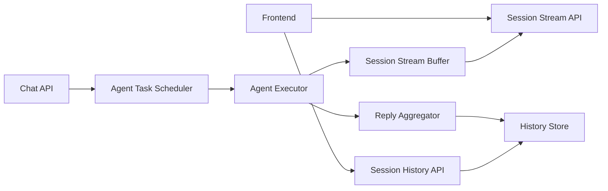

# Session Stream Buffer Design

日期: 2026-03-11
状态: 设计草案

## 1. 背景

当前 `common-agent` 已经具备：

- `POST /api/agent/chat` 提交 prompt
- `GET /api/agent/session/{sessionId}/history` 查询历史消息
- `GET /api/agent/session/{sessionId}/stream` 建立 SSE 订阅

但现有流式能力只覆盖“已经在线的订阅者”。如果 agent 在后台异步生成内容，而前端稍后才建立 SSE，则之前已经产生的流事件无法被补齐。

这里真正要解决的问题不是“如何把所有 token 永久保存”，而是：

- 已完成消息能够直接从 history 获取
- 正在生成中的消息能够以流式方式继续推送
- 中间流层只保留当前 session 尚未聚合落库的那一段数据
- 聚合成功后能够安全重置当前流缓冲

## 2. 设计目标

本方案要实现的能力：

- 前端任意时刻进入会话，都能先拿到完整历史
- 如果当前存在未完成回答，前端能继续看到这条回答的实时流
- 流式中间层可替换，支持内存、Redis、MQ、数据库等不同实现
- 中间流层不承担永久历史存储职责
- 已聚合完成的数据可以从中间层清理，避免无界增长

本方案暂不解决：

- token 级永久审计留痕
- 多轮未完成回答并行生成
- 跨机房全局顺序一致性
- 复杂消费组语义

## 3. 核心原则

### 3.1 历史和流分离

历史消息与当前流消息必须分开处理：

- `history store` 只保存已经完成的正式消息
- `stream buffer` 只保存当前未完成回答的流片段

前端展示逻辑为：

`页面消息 = history messages + 当前 in-flight response`

这能避免前端晚加入时，把所有旧 token 再重新流一遍。

### 3.2 中间流层不是消息库

中间流层只是一段短期缓冲区，不负责保存完整对话历史。

如果把它当成永久消息库，会出现三个问题：

- 流数据无限增长
- SSE 订阅与消息持久化职责耦合
- 清理策略复杂且容易误删

### 3.3 清理时机绑定“一轮回答”

缓冲区的生命周期不应绑定整个 session，而应绑定“当前这一轮 assistant reply”。

只有在这一轮回答满足以下条件后，才允许清理：

- agent 已经输出 `DONE` 或 `ERROR`
- 聚合器已将当前流片段合并为正式消息
- 正式消息已成功落入 history store

## 4. 目标架构

职责拆分：

- `Chat API`: 接收用户请求，创建任务，不等待完整回答
- `Agent Executor`: 后台异步生成 chunk
- `Session Stream Buffer`: 保存当前未完成回答的流片段
- `Reply Aggregator`: 将 chunk 聚合成完整 assistant message
- `History Store`: 存正式历史消息
- `Session Stream API`: 向在线前端推送当前 in-flight 内容

## 5. 数据模型

### 5.1 History Store

`history store` 只保存正式消息，例如：

- 用户消息
- 已完成 assistant 消息
- 工具调用完成结果
- 错误终态消息

它不保存“正在输出中的半截回答”。

### 5.2 Stream Buffer

`stream buffer` 只保存当前未完成回答：

- `sessionId`
- `responseId`
- `seq`
- `chunk`
- `status`
- `createdAt / updatedAt`

其中：

- `responseId` 用于区分同一 session 内不同轮次回答
- `seq` 用于保持当前回答内部顺序
- `status` 至少应支持 `STREAMING / DONE / ERROR`

### 5.3 聚合结果

聚合器拿到一轮回答的全部 chunk 后，生成一条正式 assistant message 落入 history。落库成功后，该 `responseId` 对应的流缓冲可被重置。

## 6. 请求流程

### 6.1 POST /chat

`POST /chat` 的职责应为：

1. 校验请求
2. 写入用户消息到 history
3. 创建或复用 session
4. 提交后台 agent 异步任务
5. 立即返回 `sessionId`

它不应等待整轮 agent 输出完成。

### 6.2 agent 后台执行

后台 agent 每产出一个 chunk：

1. 追加到 `stream buffer`
2. 推送给当前在线 SSE 订阅者
3. 持续更新当前 `responseId` 的聚合上下文

完成时：

1. 聚合当前回答
2. 写入 history store
3. 标记当前流回答完成
4. 清空或重置当前 `responseId` 的缓冲

### 6.3 前端进入会话

前端进入会话时，不需要从第一句话开始重新流式回放。正确步骤是：

1. 调用 history 接口获取完整历史消息
2. 建立 SSE 订阅
3. 如果当前存在未完成回答，则接收这条回答后续新增的 chunk

这意味着：

- 历史消息靠 history 接口
- 当前流效果靠 SSE

## 7. SSE 语义

SSE 不负责补全全量历史，只负责“当前活动回答”的实时增量。

推荐事件语义：

- `TEXT_CHUNK`: 当前回答新增文本片段
- `TOOL_CALL`: 工具调用开始或中间状态
- `TOOL_RESULT`: 工具结果片段或完成结果
- `ERROR`: 当前回答异常结束
- `DONE`: 当前回答正常结束

如果前端订阅时当前没有 active response：

- SSE 可以保持空连接等待下一轮回答
- 或由上层自行选择需要时再订阅

## 8. 清理与重置策略

这里最容易做错。

不允许在“消息聚合开始”时就清空缓冲，也不允许在“某个订阅者已看到”后就清空缓冲。正确条件是：

- 当前回答已结束
- 当前回答已完成聚合
- 聚合结果已成功落入 history

只有满足这三个条件，才能重置当前 `responseId` 的流缓冲。

推荐重置粒度：

- 重置当前 `responseId`
- 不重置整个 session

这样可以避免 session 仍有效时，后续新一轮回答被错误影响。

## 9. 可插拔实现建议

统一抽象目标不是“所有实现能力完全一致”，而是统一对上层暴露同一语义：

- 追加当前流片段
- 读取当前活跃流状态
- 标记当前回答完成
- 重置当前回答缓冲

### 9.1 内存实现

适合：

- 单机开发
- 单元测试
- 本地联调

优点：

- 简单
- 延迟低

缺点：

- 重启丢失
- 多实例不共享

### 9.2 Redis 实现

适合：

- 多实例部署
- 需要共享当前流状态
- 需要 TTL 自动清理

优点：

- 实时性较好
- 支持过期策略
- 运维成本可控

缺点：

- 仍需谨慎设计 responseId 和清理边界

### 9.3 MQ 实现

适合：

- 事件广播需求强
- agent 输出需要被多个系统旁路消费

缺点：

- MQ 更像日志分发，不天然适合“仅保留当前未完成缓冲”
- 需要额外状态存储来维护当前 active response

结论：

MQ 可以作为分发通道，但通常不应单独承担当前流缓冲职责。

### 9.4 数据库实现

适合：

- 简化技术栈
- 低并发环境

缺点：

- 高频 chunk 读写性能一般
- 作为中间缓冲不如 Redis/内存合适

结论：

数据库更适合 history store，不适合高频 in-flight buffer。

## 10. 风险评估

### 10.1 风险：SSE 被误当成存储

如果把 SSE 连接本身当成“流数据已经可靠存在”的依据，会在晚订阅、断线、服务重启时丢失当前回答。

### 10.2 风险：缓冲清理过早

如果在聚合尚未成功落库时就清空缓冲，一旦落库失败，这轮回答既不在 history，也不在 buffer，会直接丢数据。

### 10.3 风险：缓冲与 session 生命周期绑定过死

如果直接按 session 整体重置，而不是按当前回答重置，会干扰同一会话内后续轮次。

### 10.4 风险：允许多个未完成回答并行

如果后续要支持同一 session 并发多轮回答，当前模型会被破坏。此时必须把 `responseId` 提升为一等公民，不能只靠 `sessionId`。

## 11. 推荐结论

建议采用以下语义：

- `history store` 保存全部正式历史消息
- `stream buffer` 仅保存 session 当前未完成回答
- 前端进入会话时先查 history，再订阅当前流
- 当前回答聚合落库成功后，仅重置这一轮回答的流缓冲

一句话解释：

“旧消息看历史，正在说的话看流；话说完并记到账本后，草稿纸就可以清掉。”
