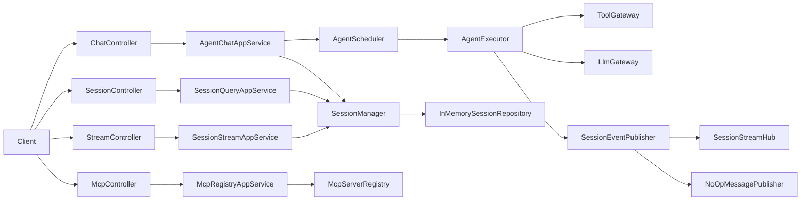
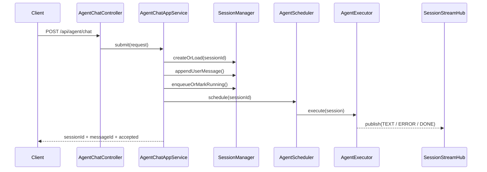
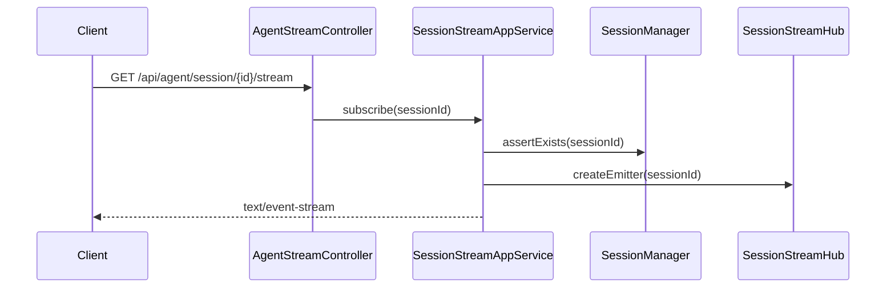

# Common Agent - Technical Design

版本: 2.0.0
日期: 2026-03-11
状态: 设计已对齐，进入第一阶段编码

## 1. 需求对齐

### 1.1 要解决的问题

`common-agent` 不是独立应用仓库，而是 `common-lib` 下的公共模块。

这意味着这里真正要交付的不是一个 `AgentScaffoldApplication`，而是一套可复用的 Agent 能力组件，供上层业务服务按需接入：

- 会话管理
- 流式消息分发
- Agent 执行编排
- MCP 工具注册与调用抽象
- LLM 适配抽象

如果直接按“独立服务”思路在本模块里写主程序、强耦合控制器和具体运行时，后续会出现三个问题：

- 公共库和业务服务边界混乱，无法复用
- 依赖栈与 `common-lib` 现有 Spring MVC 体系冲突
- LLM/MCP 的高变动实现被写死，后续替换成本高

### 1.2 明确需求

第一阶段必须支持：

- 基于 `sessionId` 的对话会话
- 用户消息提交
- SSE 订阅会话输出
- 会话历史查询
- 会话销毁
- MCP Server 注册与查询的内存实现
- Agent 运行时抽象和默认占位实现

第一阶段暂不直接做：

- 真实 OpenAI / Gemini 联调
- 真实 MCP SSE 长连接调用
- 多节点会话共享
- 持久化存储
- Last-Event-ID 断点续传

我做这个假设，是因为当前仓库里没有任何 `common-agent` 源码，也没有现成的 MCP/LLM 基础设施适配层。先把核心运行骨架、接口和测试稳定下来，才能避免后面边接 SDK 边改核心模型。

### 1.3 隐含约束

- 当前父工程是公共库聚合工程，不是单服务工程
- 现有 Web 体系基于 `spring-boot-starter-web`
- 父工程已经导入 `langchain4j-bom`
- 现有公共能力偏向 AutoConfiguration + 可嵌入式组件

### 1.4 风险点

这里有两个会直接出问题的设计点：

- 如果 `pendingQueue` 无上限，突发消息会把单机内存打爆
- 如果历史消息只增不裁剪，长会话会导致上下文和堆内存同时失控

所以第一阶段必须把这两个点做成可配置硬限制，而不是等“后续版本再说”。

## 2. 技术决策

### 2.1 模块定位

`common-agent` 定位为公共库模块，提供：

- domain: 核心模型与状态机
- app: 用例编排
- infra: SSE / 内存仓库 / MCP 注册表 / 默认 Agent 执行器
- trigger: 对外 HTTP 接口
- config: 自动装配与配置项

不在本模块中提供：

- `main` 启动类
- 独立部署脚手架

如果后续需要独立运行服务，应该新建 `agent-scaffold-server` 或示例工程，由它依赖 `common-agent`。

### 2.2 技术栈选择

- Java 21
- Spring Boot 3.5.x
- Spring MVC + `SseEmitter`
- Lombok
- Jakarta Validation
- JUnit 5

不选 WebFlux 的原因：

- 当前 `common-lib` 主 Web 栈是 MVC
- `common-web-notify` 也是基于 `SseEmitter`
- 第一阶段重点是稳定的会话模型，不是响应式全链路

这会牺牲一部分响应式编排的优雅性，换来与现有工程的一致性和更低的接入成本。

### 2.3 Agent 框架决策

第一阶段不把 `google-adk` 直接写死到会话核心里。

改为两层抽象：

- `AgentExecutor`: 负责任务执行与流式事件回调
- `ToolGateway` / `LlmGateway`: 负责工具与模型访问

这样做的原因：

- 可以先用默认占位执行器把系统跑通
- 后续接 ADK 或 LangChain4j 时，不需要重写会话/控制器/流式分发

## 3. 架构设计



## 4. 分层职责

### 4.1 domain

- `AgentSession`: 会话聚合根
- `SessionStatus`: `IDLE / RUNNING / CLOSED`
- `AgentMessage`: 统一消息模型
- `MessageRole`: `USER / ASSISTANT / TOOL / SYSTEM`
- `MessageType`: `TEXT / TOOL_CALL / TOOL_RESULT / ERROR / DONE`

### 4.2 app

- `AgentChatAppService`: 处理聊天入口、建会话、入队、触发调度
- `SessionQueryAppService`: 查询会话与历史
- `SessionStreamAppService`: 创建 SSE 订阅
- `McpRegistryAppService`: 注册和查询 MCP Server

### 4.3 infra

- `InMemorySessionRepository`: 内存态会话存储
- `DefaultSessionManager`: 状态迁移、队列控制、历史裁剪
- `SseSessionStreamHub`: 每个会话维护多个 `SseEmitter`
- `InMemoryMcpServerRegistry`: MCP 注册表内存实现
- `NoOpAgentExecutor`: 默认占位执行器，返回可解释错误
- `NoOpMessagePublisher`: MQ 扩展点默认空实现

### 4.4 trigger

- `AgentChatController`
- `AgentSessionController`
- `AgentStreamController`
- `AgentMcpController`

## 5. 核心数据结构

### 5.1 AgentSession

```java
public class AgentSession {
    private String sessionId;
    private SessionStatus status;
    private Deque<PendingUserMessage> pendingQueue;
    private List<AgentMessage> history;
    private Instant lastActiveAt;
    private Instant createdAt;
    private boolean closed;
}
```

### 5.2 配置项

```yaml
app:
  agent:
    enabled: true
    session-timeout-minutes: 30
    max-history-messages: 50
    max-pending-messages: 100
    sse-timeout-ms: 300000
    sse-heartbeat-seconds: 15
    max-prompt-length: 10000
```

## 6. 关键流程

### 6.1 发送消息



### 6.2 SSE 订阅



## 7. 编码目录

```text
src/main/java/com/dev/lib/agent/
  config/
  domain/
    model/
    service/
  app/
  infra/
    session/
    stream/
    mcp/
    agent/
    publish/
  trigger/http/
    controller/
    request/
    response/

src/test/java/com/dev/lib/agent/
  domain/
  app/
  infra/
  trigger/
```

## 8. 第一阶段编码范围

第一阶段只做三个可验证组件：

1. 会话核心模型和 `SessionManager`
2. HTTP + SSE 接口骨架
3. 默认占位 `AgentExecutor` 与 MCP 注册表

这是刻意控制范围。一次把真实 LLM、真实 MCP、会话持久化都塞进来，只会同时引入并发、网络、协议兼容三类问题，测试会失真。

## 9. 测试策略

- `AgentSessionTest`: 状态迁移、历史裁剪、队列上限
- `DefaultSessionManagerTest`: 创建、提交、销毁、超时清理
- `AgentChatControllerTest`: 参数校验与返回体
- `AgentStreamControllerTest`: 会话不存在、订阅成功
- `InMemoryMcpServerRegistryTest`: 注册、覆盖更新、查询

## 10. 实施检查点

### 检查点 A

- `readme.md` 设计完成
- 会话域模型测试先写失败

### 检查点 B

- 会话核心实现完成
- 第一批单测通过

### 检查点 C

- HTTP/SSE 骨架完成
- 控制器测试通过

### 检查点 D

- MCP 注册表与默认执行器完成
- 模块测试和编译通过

## 11. 当前结论

可以开始编码，但必须按这个顺序：

1. 先写失败测试
2. 再补最小实现
3. 每一层只交付当前检查点所需代码

不这样做，最先坏掉的会是会话状态机和并发边界，而不是接口长得好不好看。
