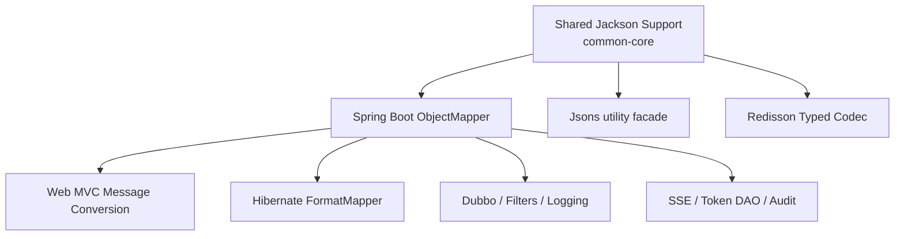
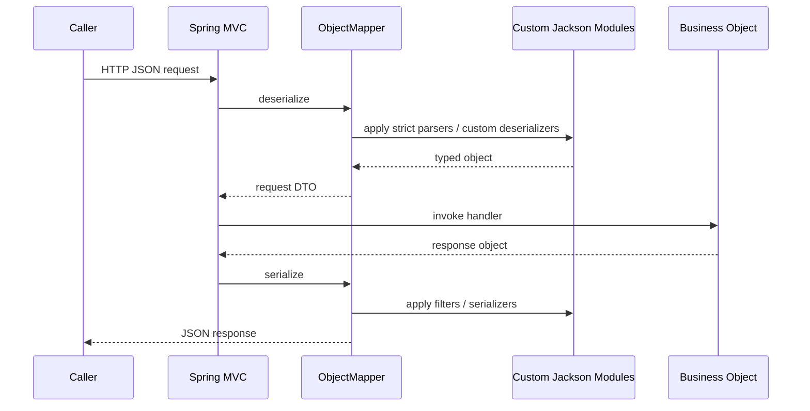

# Jackson Migration Implementation Plan

> **For Codex:** REQUIRED SUB-SKILL: Use superpowers:executing-plans to implement this plan task-by-task.

**Goal:** Replace all `fastjson2` usage in `common-lib` with `ObjectMapper/Jackson` while preserving external JSON behavior where practical and intentionally tightening permissive parsing.

**Architecture:** Introduce a shared Jackson support layer in `common-core`, let Spring Boot own the primary `ObjectMapper`, and route Web MVC, Hibernate JSON mapping, Redisson codec, and utility serialization through that single configuration. Fastjson2-specific filters and codecs are replaced with Jackson-native serializers, modifiers, and mapper-backed adapters.

**Tech Stack:** Spring Boot 3.5, Jackson, Hibernate 6 `FormatMapper`, Redisson codec SPI, JUnit 5, Maven

---

## Phase 1: Requirements Alignment

Confirmed requirements:
- Replace bottom-layer `fastjson2` usage across all modules with `ObjectMapper/Jackson`.
- Preserve current JSON protocol behavior as much as possible.
- Tightening permissive parsing is allowed.
- Replace Web serialization optimizations, not only the converter class.
- Remove fastjson2 dependencies after migration.

Assumptions:
- Existing Redis / DB JSON payloads should remain readable when they are valid standard JSON.
- Non-standard JSON previously accepted by fastjson2 may become invalid after migration.
- Type metadata for Redisson cache entries still needs polymorphic reconstruction.

Here is what will break if these assumptions are wrong:
- If Redis contains fastjson2-specific auto-type payloads incompatible with Jackson polymorphic typing, cached objects may fail to deserialize.
- If upstream callers send unquoted field names or other relaxed JSON, request deserialization may start rejecting them.
- If downstream consumers depended on omitted/rounded/null-handling quirks, API snapshots may change.

## Solution Design

### Architecture

### Component responsibilities

- `common-core`
  - Provide shared Jackson configuration constants, modules, serializers, deserializers, and utility facade.
  - Register date/time, `BigDecimal`, and large `Long` handling.
  - Apply field exclusion and populate-field expansion through Jackson hooks.
- `common-starter`
  - Remove `FastJsonHttpMessageConverter`.
  - Customize Spring MVC `ObjectMapper` / Jackson builder instead of overriding converters directly.
- `common-data-jpa`
  - Replace `FastJson2FormatMapper` with Jackson-backed `FormatMapper`.
- `common-cache`
  - Replace fastjson2 Redisson codec with a Jackson codec using safe polymorphic typing for cached values.
- Other modules
  - Replace direct `JSON.*` calls with shared `Jsons` helper or injected `ObjectMapper`.

### Data flow

### Tradeoffs

- Use one shared `ObjectMapper`:
  - This trades off local customization freedom for consistent behavior because Web, JPA, logging, and utility serialization should not drift.
- Tighten parsing:
  - This trades off some backward compatibility for safer and more predictable input handling because fastjson2 currently accepts formats Jackson should reject by default.
- Keep cache polymorphism:
  - This trades off stricter type controls for deserialization fidelity because Redisson stores heterogeneous values.

### Risk assessment

- Risk: `PopulateFieldAfterFilter` has no direct Jackson equivalent.
  - Mitigation: implement a Jackson serializer modifier or wrapper serializer for annotated bean types.
- Risk: Redisson codec polymorphism can become unsafe.
  - Mitigation: use `BasicPolymorphicTypeValidator` with package allow-list for internal classes.
- Risk: Hibernate JSON string output changes.
  - Mitigation: cover with mapper-level tests for dates, numbers, enums, and null omission.
- Risk: existing tests are sparse.
  - Mitigation: add focused regression tests before implementation.

## Incremental Execution

### Task 1: Add shared Jackson support tests

**Files:**
- Create: `common-core/src/test/java/com/dev/lib/config/JacksonSupportTest.java`

**Step 1: Write the failing test**

Cover:
- `Instant` serializes as `yyyy-MM-dd HH:mm:ss` in `Asia/Shanghai`
- `BigDecimal` serializes to 6 decimal places
- large `Long` serializes as string
- null fields are omitted
- enum uses `toString`

**Step 2: Run test to verify it fails**

Run: `mvn -pl common-core -DskipTests=false -Dtest=JacksonSupportTest test`

**Step 3: Write minimal implementation**

Create shared Jackson support and `JacksonConfig`.

**Step 4: Run test to verify it passes**

Run: `mvn -pl common-core -DskipTests=false -Dtest=JacksonSupportTest test`

### Task 2: Replace Web MVC fastjson2 integration

**Files:**
- Modify: `common-starter/src/main/java/com/dev/lib/config/WebMvcConfig.java`
- Modify: `common-starter/src/main/java/com/dev/lib/config/PopulateFieldAfterFilter.java`
- Create: `common-starter/src/test/java/com/dev/lib/config/WebMvcJacksonConfigTest.java`

**Step 1: Write the failing test**

Cover:
- excluded fields are not emitted
- populate fields are appended
- request/response conversion uses Jackson rather than fastjson2 converter

**Step 2: Run test to verify it fails**

Run: `mvn -pl common-starter -DskipTests=false -Dtest=WebMvcJacksonConfigTest test`

**Step 3: Write minimal implementation**

Replace converter registration with Jackson builder/object mapper customization and Jackson-native populate-field serializer support.

**Step 4: Run test to verify it passes**

Run: `mvn -pl common-starter -DskipTests=false -Dtest=WebMvcJacksonConfigTest test`

### Task 3: Replace Hibernate JSON mapper

**Files:**
- Modify: `common-data-jpa/src/main/java/com/dev/lib/jpa/config/HibernateJsonConfig.java`
- Create: `common-data-jpa/src/test/java/com/dev/lib/jpa/config/HibernateJsonConfigTest.java`

**Step 1: Write the failing test**

Cover JSON read/write through `FormatMapper` using shared Jackson support.

**Step 2: Run test to verify it fails**

Run: `mvn -pl common-data-jpa -DskipTests=false -Dtest=HibernateJsonConfigTest test`

**Step 3: Write minimal implementation**

Inject shared `ObjectMapper` and implement Jackson-backed `FormatMapper`.

**Step 4: Run test to verify it passes**

Run: `mvn -pl common-data-jpa -DskipTests=false -Dtest=HibernateJsonConfigTest test`

### Task 4: Replace Redisson codec and direct JSON helpers

**Files:**
- Modify: `common-cache/src/main/java/com/dev/lib/cache/FastJson2JsonRedissonSerializer.java`
- Modify: `common-cache/src/main/java/com/dev/lib/cache/config/RedissonConfig.java`
- Modify: `common-cloud/src/main/java/com/dev/lib/cloud/filter/UserContextConsumerFilter.java`
- Modify: `common-cloud/src/main/java/com/dev/lib/cloud/filter/UserContextProviderFilter.java`
- Modify: `common-starter/src/main/java/com/dev/lib/web/LoggingFilter.java`
- Modify: `common-security-sa/src/main/java/com/dev/lib/security/domain/DbSaTokenDao.java`
- Modify: `common-data-jpa/src/main/java/com/dev/lib/jpa/entity/insert/FieldMeta.java`
- Modify: `common-data-jpa/src/main/java/com/dev/lib/jpa/entity/log/OperateLogAspect.java`
- Modify: `common-data-jpa/src/main/java/com/dev/lib/jpa/entity/audit/AuditListener.java`
- Modify: `common-web-notify/src/main/java/com/dev/lib/notify/core/SseEmitterManager.java`

**Step 1: Write the failing test**

Add focused tests around utility methods and cache codec.

**Step 2: Run test to verify it fails**

Run targeted Maven tests per module.

**Step 3: Write minimal implementation**

Use shared `Jsons` helper or constructor-injected `ObjectMapper`.

**Step 4: Run test to verify it passes**

Run targeted Maven tests per module.

### Task 5: Remove fastjson2 dependencies and update docs

**Files:**
- Modify: `pom.xml`
- Modify: `common-starter/pom.xml`
- Modify: `readme.md`
- Modify: `common-starter/project.md`

**Step 1: Write the failing check**

Run: `rg -n "fastjson2|FastJson" common-* pom.xml`
Expected: remaining matches identify unremoved references.

**Step 2: Write minimal implementation**

Delete dependencies and update docs.

**Step 3: Run verification**

Run:
- `rg -n "fastjson2|FastJson" common-* pom.xml`
- `mvn -pl common-core,common-starter,common-data-jpa,common-cache,common-cloud,common-security-sa,common-web-notify -DskipTests=false test`

Expected:
- No fastjson2 runtime usage remains.
- Targeted tests pass.

## Verification strategy

- Unit-test shared mapper semantics in `common-core`.
- Unit-test Web MVC JSON output in `common-starter`.
- Unit-test Hibernate mapper round-trip in `common-data-jpa`.
- Smoke-test Redisson codec encode/decode without Redis.
- Run module-scoped Maven tests rather than full-repo suite first because the workspace already has unrelated test file modifications in `common-agent`.

