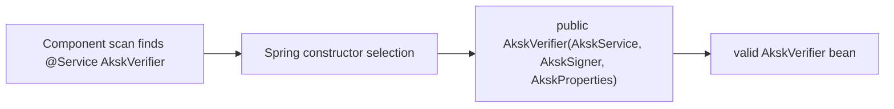
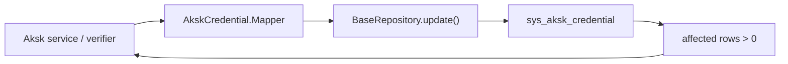
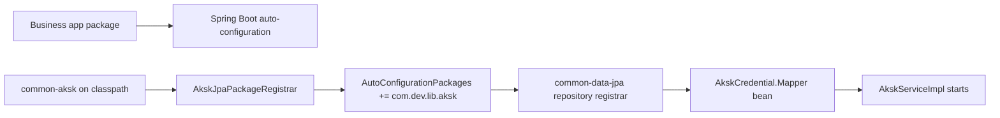

# Common AK/SK Implementation Plan

> **For Codex:** REQUIRED SUB-SKILL: Use superpowers:executing-plans to implement this plan task-by-task.

**Goal:** Build `common-aksk` as a reusable AK/SK lifecycle and signed-request authentication module, and integrate it into `common-security` so annotated business endpoints can be authenticated with AK/SK while `/admin/**` is protected by role `admin`.

**Architecture:** `common-aksk` owns credential persistence, admin CRUD, `@Aksk`, signing, verification, scope authorization, and `AkskContextHolder`. `common-security` depends on `common-aksk`, runs AK/SK authentication before normal token auth, writes successful AK/SK requests into `SecurityContextHolder`, and enforces `/admin/**` role checks before whitelist or `@Anonymous` can bypass anything.

**Tech Stack:** Java 25, Spring Boot 4.1 RC, common-data-jpa `JpaEntity`/`BaseRepository`/`DslQuery`, Hibernate JSON mapping with `@JdbcTypeCode(SqlTypes.JSON)`, existing `@Encrypt`, Spring MVC interceptors/filters, Maven/JUnit/AssertJ.

---

## Execution Progress

Last updated: 2026-05-08 16:36 Asia/Shanghai.

Current checkpoint: Task 16 common-lib fix complete. Downstream datalake startup verification is blocked before Spring starts by `com.ware4u:datalake-bom:1.0` jar resolution.

Completed tasks:

- Task 1: module wiring and unsafe placeholder removal.
- Task 2: signing primitives and header resolution.
- Task 3: credential persistence and lifecycle service.
- Task 4: verifier and `AkskContextHolder`.
- Task 5: admin controller and controller tests.
- Task 6: `/admin/**` role rule in `common-security`.
- Task 7: AK/SK authentication integration in `common-security`.
- Task 8: JPA integration coverage for nested repository, JSON fields, soft delete, and encrypted SecretKey persistence.
- Task 9: `common-aksk/README.md` documentation and example usage.
- Task 10: final verification.
- Task 11: repository and service lifecycle paths now use guarded bulk updates instead of read-modify-save.
- Task 15: `common-aksk` now registers `com.dev.lib.aksk` as a narrow auto-configuration package; `common-data-jpa` normalizes parent/child package overlaps before repository scanning.

Follow-up change request:

- Task 11: Replace `AkskCredential.Mapper` read-modify-save lifecycle helpers with guarded `update()` bulk updates.
- Task 12: Simplify `touchLastUsed`; it should use the same direct `update().set(...).where(...).execute()` shape as the status helpers.
- Task 13: Replace `AkskServiceImpl` DTO/entity/VO hand-written field mapping with MapStruct Plus generated mappers.
- Task 14: Remove controller-level `/admin/aksk` mapping and put full `/admin/aksk/*_aksk` routes on methods.
- Task 15: Make `common-aksk` register its own JPA auto-configuration package so business services do not need `@EntityScan` or manual repository scanning.
- Task 16: Fix `AkskVerifier` bean construction failure caused by multiple constructors without an explicit Spring injection constructor.

Verification evidence so far:

- Baseline: `JAVA_HOME=$(/usr/libexec/java_home -v 25) mvn -pl common-aksk,common-security -am test -DskipTests=false` -> BUILD SUCCESS.
- Task 1 compile: `JAVA_HOME=$(/usr/libexec/java_home -v 25) mvn -pl common-aksk,common-security -am test -DskipTests` -> BUILD SUCCESS.
- Task 2: `JAVA_HOME=$(/usr/libexec/java_home -v 25) mvn -pl common-aksk -Dtest=AkskSignerTest,AkskHeaderResolverTest test` -> 9 tests passed.
- Task 3: `JAVA_HOME=$(/usr/libexec/java_home -v 25) mvn -pl common-aksk -Dtest=AkskKeyGeneratorTest,AkskServiceTest test` -> 9 tests passed.
- Task 4: `JAVA_HOME=$(/usr/libexec/java_home -v 25) mvn -pl common-aksk -Dtest=AkskVerifierTest,AkskContextHolderTest test` -> 16 tests passed.
- Task 5 RED: `JAVA_HOME=$(/usr/libexec/java_home -v 25) mvn -pl common-aksk -Dtest=AkskAdminControllerTest test` -> failed at test compile because `AkskAdminController` did not exist.
- Task 5 GREEN: `JAVA_HOME=$(/usr/libexec/java_home -v 25) mvn -pl common-aksk -Dtest=AkskAdminControllerTest test` -> 5 tests passed.
- Current module suite: `JAVA_HOME=$(/usr/libexec/java_home -v 25) mvn -pl common-aksk test` -> 39 tests passed.
- Task 6 RED: `JAVA_HOME=$(/usr/libexec/java_home -v 25) mvn -pl common-security -Dtest=AdminPathSecurityTest test` -> 4 failures: `/admin/**` not registered, user role allowed, `@Anonymous` bypassed admin, whitelist bypassed admin.
- Task 6 GREEN: `JAVA_HOME=$(/usr/libexec/java_home -v 25) mvn -pl common-security -Dtest=AdminPathSecurityTest test` -> 7 tests passed.
- Current security module suite: `JAVA_HOME=$(/usr/libexec/java_home -v 25) mvn -pl common-security test` -> 7 tests passed.
- Task 7 plan command note: `JAVA_HOME=$(/usr/libexec/java_home -v 25) mvn -pl common-security -Dtest=AkskAuthenticationInterceptorTest,AkskSecurityIntegrationTest test` failed before the intended RED because the in-workspace `common-aksk` dependency was not built in the reactor.
- Task 7 RED: `JAVA_HOME=$(/usr/libexec/java_home -v 25) mvn -pl common-security -am -Dtest=AkskAuthenticationInterceptorTest,AkskSecurityIntegrationTest -Dsurefire.failIfNoSpecifiedTests=false test` -> failed at test compile because `AkskAuthenticationInterceptor` and `com.dev.lib.security.aksk` classes did not exist.
- Task 7 edge RED: `JAVA_HOME=$(/usr/libexec/java_home -v 25) mvn -pl common-security -am -Dtest=AkskAuthenticationInterceptorTest -Dsurefire.failIfNoSpecifiedTests=false test` -> failed at test compile because oversized-body skip marker did not exist.
- Task 7 GREEN: same reactor-aware command -> 7 `AkskAuthenticationInterceptorTest` tests passed, including oversized-body skip handling.
- Task 6 + Task 7 security regression: `JAVA_HOME=$(/usr/libexec/java_home -v 25) mvn -pl common-security -am -Dtest=AdminPathSecurityTest,AkskAuthenticationInterceptorTest,AkskSecurityIntegrationTest -Dsurefire.failIfNoSpecifiedTests=false test` -> 17 tests passed.
- Current `common-aksk` module after bean-registration annotations: `JAVA_HOME=$(/usr/libexec/java_home -v 25) mvn -pl common-aksk test` -> 39 tests passed.
- Task 8 RED: `JAVA_HOME=$(/usr/libexec/java_home -v 25) mvn -pl common-aksk -Dtest=AkskCredentialRepositoryIntegrationTest test` -> failed because `EncryptionListener` required an `EncryptionService` bean.
- Task 8 GREEN: same command -> 1 test passed after importing existing Base64 encryption test configuration and asserting raw `secret_key` is encrypted while repository reads return plaintext.
- Current `common-aksk` module after Task 8: `JAVA_HOME=$(/usr/libexec/java_home -v 25) mvn -pl common-aksk test` -> 40 tests passed.
- Task 9 verification: `JAVA_HOME=$(/usr/libexec/java_home -v 25) mvn -pl common-aksk test` -> 40 tests passed.
- Task 9 diff hygiene: `git diff --check` -> exit 0.
- Task 10 `common-aksk`: `JAVA_HOME=$(/usr/libexec/java_home -v 25) mvn -pl common-aksk test` -> 40 tests passed.
- Task 10 `common-security` first attempt: `JAVA_HOME=$(/usr/libexec/java_home -v 25) mvn -pl common-security test` -> failed at test discovery because Maven resolved a stale local `common-aksk` artifact that did not contain `AkskVerifier`.
- Task 10 local dependency refresh: `JAVA_HOME=$(/usr/libexec/java_home -v 25) mvn -pl common-aksk install -DskipTests` -> BUILD SUCCESS; this changed only the local Maven repository.
- Task 10 `common-security` rerun: `JAVA_HOME=$(/usr/libexec/java_home -v 25) mvn -pl common-security test` -> 17 tests passed.
- Task 10 combined reactor: `JAVA_HOME=$(/usr/libexec/java_home -v 25) mvn -pl common-security -am test` -> reactor BUILD SUCCESS across `common-lib`, `common-util`, `common-core`, `common-excel`, `common-starter`, `common-data-jpa`, `common-aksk`, and `common-security`.
- Task 10 final diff hygiene: `git diff --check` -> exit 0.
- Task 10 git status: `git status --short` -> only AK/SK implementation, tests, README, plan, memory, and prior placeholder/CLAUDE removals are present.
- Diff hygiene: `git diff --check` -> exit 0.
- Latest dependency compile: `JAVA_HOME=$(/usr/libexec/java_home -v 25) mvn -pl common-aksk,common-security -am test -DskipTests` -> BUILD SUCCESS.
- Task 11 RED: `JAVA_HOME=$(/usr/libexec/java_home -v 25) mvn -pl common-aksk -Dtest=AkskCredentialRepositoryIntegrationTest test` -> failed as expected because `markActive` loaded credential entities before updating.
- Task 11 first GREEN attempt: same command -> failed because the narrow `common-aksk` JPA test context did not register `TransactionHelper`, which `UpdateBuilder` requires.
- Task 11 GREEN: same command -> 2 tests passed after importing `TransactionHelper` into the test context and changing lifecycle helpers to bulk updates.
- Task 11 service RED: `JAVA_HOME=$(/usr/libexec/java_home -v 25) mvn -pl common-aksk -Dtest=AkskServiceTest test` -> failed because service enable/disable/touchLastUsed still used read-modify-save paths.
- Task 11 service GREEN: same command -> 7 tests passed after delegating service lifecycle paths to mapper bulk helpers.
- Task 11 final `common-aksk`: `JAVA_HOME=$(/usr/libexec/java_home -v 25) mvn -pl common-aksk test` -> 42 tests passed.
- Task 11 final diff hygiene: `git diff --check` -> exit 0.
- Task 12 RED: `JAVA_HOME=$(/usr/libexec/java_home -v 25) mvn -pl common-aksk -Dtest=AkskCredentialRepositoryIntegrationTest test` -> failed because current `touchLastUsed` explicitly cleared null IP instead of letting `set` skip it.
- Task 12 GREEN: same command -> 2 tests passed after simplifying `touchLastUsed` to direct chained `set` calls.
- Task 13 RED: `JAVA_HOME=$(/usr/libexec/java_home -v 25) mvn -pl common-aksk -Dtest=AkskServiceTest test` -> failed at test compile because `AkskServiceImpl` did not inject/use MapStruct Plus `Converter`.
- Task 13 GREEN: same command -> 8 tests passed after adding AutoMapper annotations and replacing create/update/list/detail hand mapping with `Converter` calls.
- Task 13 final `common-aksk`: `JAVA_HOME=$(/usr/libexec/java_home -v 25) mvn -pl common-aksk test` -> 43 tests passed.
- Task 13 final diff hygiene: `git diff --check` -> exit 0.
- Task 14 RED: `JAVA_HOME=$(/usr/libexec/java_home -v 25) mvn -pl common-aksk -Dtest=AkskAdminControllerTest test` -> failed because class-level `@RequestMapping("/admin/aksk")` still existed.
- Task 14 GREEN: same command -> 5 tests passed after moving all admin paths to method-level full routes.
- Task 14 final `common-aksk`: `JAVA_HOME=$(/usr/libexec/java_home -v 25) mvn -pl common-aksk test` -> 43 tests passed.
- Task 14 final diff hygiene: `git diff --check` -> exit 0.
- Task 15 RED: `JAVA_HOME=$(/usr/libexec/java_home -v 25) mvn -pl common-aksk -Dtest=AkskRepositoryAutoConfigurationIntegrationTest test` -> failed because a non-`com.dev.lib` application package did not register `AkskCredential.Mapper`.
- Task 15 GREEN: same command -> 1 test passed after adding `AkskAutoConfiguration` and `META-INF/spring/org.springframework.boot.autoconfigure.AutoConfiguration.imports`.
- Task 15 overlap regression: `JAVA_HOME=$(/usr/libexec/java_home -v 25) mvn -pl common-aksk -am -Dtest=AkskRepositoryAutoConfigurationIntegrationTest,AkskCredentialRepositoryIntegrationTest -Dsurefire.failIfNoSpecifiedTests=false test` -> 3 tests passed after `common-data-jpa` normalized parent/child scan package overlaps.
- Task 15 full reactor: `JAVA_HOME=$(/usr/libexec/java_home -v 25) mvn -pl common-aksk -am test` -> reactor BUILD SUCCESS; `common-data-jpa` 108 tests passed and `common-aksk` 44 tests passed.
- Task 15 security regression: `JAVA_HOME=$(/usr/libexec/java_home -v 25) mvn -pl common-security -am -Dtest=AdminPathSecurityTest,AkskAuthenticationInterceptorTest,AkskSecurityIntegrationTest -Dsurefire.failIfNoSpecifiedTests=false test` -> 17 tests passed.
- Task 15 local install for datalake verification: `JAVA_HOME=$(/usr/libexec/java_home -v 25) mvn -pl common-data-jpa,common-aksk -am install -DskipTests` -> BUILD SUCCESS.
- Task 15 diff hygiene: `git diff --check` -> exit 0.
- Task 16 RED: `JAVA_HOME=$(/usr/libexec/java_home -v 25) mvn -pl common-aksk -Dtest=AkskVerifierSpringContextTest test` -> failed because Spring attempted `AkskVerifier.<init>()` and reported `No default constructor found`.
- Task 16 GREEN: same command -> 1 test passed after marking the existing public dependency constructor with `@Autowired`.
- Task 16 full `common-aksk`: `JAVA_HOME=$(/usr/libexec/java_home -v 25) mvn -pl common-aksk test` -> 45 tests passed.
- Task 16 security regression: `JAVA_HOME=$(/usr/libexec/java_home -v 25) mvn -pl common-security -am -Dtest=AdminPathSecurityTest,AkskAuthenticationInterceptorTest,AkskSecurityIntegrationTest -Dsurefire.failIfNoSpecifiedTests=false test` -> 17 tests passed.
- Task 16 diff hygiene: `git diff --check` -> exit 0.
- Task 16 local install: `JAVA_HOME=$(/usr/libexec/java_home -v 25) mvn -pl common-data-jpa,common-aksk -am install -DskipTests` -> BUILD SUCCESS.
- Task 16 installed jar check: `javap` on `/Users/lucheng/.m2/repository/io/github/ilovejavac/common-aksk/1.5.1-RC0/common-aksk-1.5.1-RC0.jar` shows `@Autowired` on the public `AkskVerifier(AkskService, AkskSigner, AkskProperties)` constructor.
- Task 16 datalake startup attempt: `JAVA_HOME=$(/usr/libexec/java_home -v 25) mvn -pl datalake-server spring-boot:run -Dspring-boot.run.profiles=dev` timed out while resolving `com.ware4u:datalake-bom:1.0` as `datalake-bom-1.0.jar` from the internal HTTP repository.
- Task 16 datalake reactor workaround attempt: `JAVA_HOME=$(/usr/libexec/java_home -v 25) mvn -pl datalake-server -am install -DskipTests` still reached `datalake-server` and attempted to resolve `com.ware4u:datalake-bom:1.0` as a jar, even though the local `datalake-bom` module is packaged as a POM; the hung Maven process was stopped.

Next task:

- None for the `common-lib` AK/SK constructor fix.
- Separate downstream blocker: datalake cannot be started from Maven in this session until `datalake-server` stops resolving `datalake-bom` as a jar or the internal repository serves that jar.

Important execution note:

- Use JDK 25 for Maven commands. The default Maven runtime currently uses JDK 21 and cannot compile this project release level.
- When running `common-security` tests that compile AK/SK references before `common-aksk` is installed locally, use `-am`. With `-Dtest=...`, also pass `-Dsurefire.failIfNoSpecifiedTests=false` so upstream modules without matching test names do not fail the reactor.

---

### Task 16: Fix `AkskVerifier` Spring Constructor Selection

**Requirements confirmed:** 2026-05-08 by user reply "直接改" after the startup failure analysis.

**Problem:** Downstream `datalake` startup fails with `No default constructor found` for `AkskVerifier`. The installed `common-aksk-1.5.1-RC0.jar` contains both a public dependency constructor and a package-private test constructor, but neither constructor is marked as Spring's injection constructor.

**Design:**



**Component responsibilities:**

- `AkskVerifier`: keep mandatory dependency injection through the existing public constructor.
- Package-private clock constructor: remain available for deterministic unit tests.
- Regression test: start a Spring context with `AkskVerifier` and explicit mock dependencies to prove bean construction no longer requires a default constructor.

**Risk assessment:**

- Adding a no-arg constructor would allow invalid partially initialized verifier instances, so it is rejected.
- The test must prove Spring bean construction behavior, not only direct Java construction.
- The local Maven artifact must be refreshed because `datalake` runs against `~/.m2`, not the source tree.

**Verification commands:**

```bash
JAVA_HOME=$(/usr/libexec/java_home -v 25) mvn -pl common-aksk -Dtest=AkskVerifierSpringContextTest test
JAVA_HOME=$(/usr/libexec/java_home -v 25) mvn -pl common-aksk test
JAVA_HOME=$(/usr/libexec/java_home -v 25) mvn -pl common-security -am -Dtest=AdminPathSecurityTest,AkskAuthenticationInterceptorTest,AkskSecurityIntegrationTest -Dsurefire.failIfNoSpecifiedTests=false test
git diff --check
JAVA_HOME=$(/usr/libexec/java_home -v 25) mvn -pl common-data-jpa,common-aksk -am install -DskipTests
```

**Checkpoint:** Stop if the RED test does not fail on constructor selection, or if GREEN verification exposes a second startup failure.

---

### Task 11: Replace Repository Lifecycle Helpers With Bulk Updates

**Requirements confirmed:** 2026-05-08 by user reply "改".

**Problem:** `AkskCredential.Mapper.markActive`, `markDisable`, and `touchLastUsed` currently call `findByBizId`, mutate the loaded entity, then call `save`. This adds an avoidable read and widens the stale-state/concurrent-update window.

**Design:**



**Component responsibilities:**

- `markActive(id)`: update `status` to `active` only where `bizId = id` and current `status = disable`.
- `markDisable(id)`: update `status` to `disable` only where `bizId = id` and current `status = active`.
- `touchLastUsed(id, ip, time)`: update `lastUsedAt` and `lastUsedIp` where `bizId = id`; use `setNull` for nullable values so old audit data is not retained accidentally.
- `AkskCredential.Query`: remains the typed DslQuery carrier for `bizId` and status conditions.

**Risk controls:**

- Blank `id` returns `false` before building an update, preventing accidental broad updates.
- Status transitions include the expected current status condition, so repeated enable/disable calls are no-ops.
- Tests use Hibernate statistics to assert the lifecycle helper calls do not load `AkskCredential.Entity` rows.

**Verification commands:**

```bash
JAVA_HOME=$(/usr/libexec/java_home -v 25) mvn -pl common-aksk -Dtest=AkskCredentialRepositoryIntegrationTest test
JAVA_HOME=$(/usr/libexec/java_home -v 25) mvn -pl common-aksk test
git diff --check
```

**Checkpoint:**

```text
CHECKPOINT: aksk repository bulk updates
Evidence:
- RED repository test fails because read-modify-save loads entities.
- GREEN repository test passes after bulk update methods.
- common-aksk module tests pass.
```

---

### Task 12: Simplify `touchLastUsed`

**Requirements confirmed:** 2026-05-08 by user challenge that the current `touchLastUsed` implementation is unnecessarily complex.

**Decision:** `touchLastUsed` is an audit touch, not a lifecycle state transition. It should be a direct bulk update with `set(lastUsedAt, time)` and `set(lastUsedIp, ip)`. Because `UpdateBuilder#set` skips `null`, null IP should not trigger explicit clearing. `time` is expected from the verifier as `LocalDateTime.now(clock)`.

**Verification commands:**

```bash
JAVA_HOME=$(/usr/libexec/java_home -v 25) mvn -pl common-aksk -Dtest=AkskCredentialRepositoryIntegrationTest test
JAVA_HOME=$(/usr/libexec/java_home -v 25) mvn -pl common-aksk test
git diff --check
```

---

### Task 13: Use MapStruct Plus For AK/SK Mapping

**Requirements confirmed:** 2026-05-08 by user statement that hand-written `get`/`set` mappings should use cached AutoMapper because MapStruct Plus is available.

**Design:**

- Add MapStruct Plus annotations on `AkskCredential.Entity`.
- Generate mappers for:
  - `AkskDTO.Create -> AkskCredential.Entity`
  - `AkskDTO.Update -> AkskCredential.Entity`
  - `AkskCredential.Entity -> AkskVO.ListItem`
  - `AkskCredential.Entity -> AkskVO.Detail`
- Inject generated mappers in `AkskServiceImpl`, matching existing modules such as `DictServiceAdapt`.
- Keep business-generated fields explicit: generated access key, generated secret key, active status, and create/reset one-time plain secret response.

**Risk:** `JpaEntity.id` and API `id` do not mean the same thing; API `id` must remain `bizId`. Avoid relying on default `id` mapping for response objects.

**Verification commands:**

```bash
JAVA_HOME=$(/usr/libexec/java_home -v 25) mvn -pl common-aksk -Dtest=AkskServiceTest test
JAVA_HOME=$(/usr/libexec/java_home -v 25) mvn -pl common-aksk test
git diff --check
```

---

### Task 14: Move AK/SK Admin Routes To Method-Level Full Paths

**Requirements confirmed:** 2026-05-08 by user request: do not put `/admin/aksk` on the controller/interface; put full admin paths on methods, e.g. `/admin/aksk/create_aksk` and `/admin/aksk/update_aksk`.

**Route decisions:**

- `POST /admin/aksk/create_aksk`
- `POST /admin/aksk/update_aksk`
- `POST /admin/aksk/delete_aksk/{id}`
- `POST /admin/aksk/enable_aksk/{id}`
- `POST /admin/aksk/disable_aksk/{id}`
- `POST /admin/aksk/reset_secret_aksk/{id}`
- `POST /admin/aksk/query_list_aksk`
- `GET /admin/aksk/detail_aksk/{id}`

**Verification commands:**

```bash
JAVA_HOME=$(/usr/libexec/java_home -v 25) mvn -pl common-aksk -Dtest=AkskAdminControllerTest test
JAVA_HOME=$(/usr/libexec/java_home -v 25) mvn -pl common-aksk test
git diff --check
```

### Task 15: Auto-Register AK/SK JPA Package

**Requirements confirmed:** 2026-05-08 by user request that `common-aksk` is a manually introduced dependency and services must start without business-side `@EntityScan` or manual JPA repository scan configuration.

**Problem:** `common-starter` component scanning creates `AkskServiceImpl`, but `AkskCredential.Mapper` is a Spring Data JPA repository proxy. The current `common-data-jpa` repository registrar filters out the broad `com.dev.lib` root package and only scans business packages plus internal JPA packages. That prevents `com.dev.lib.aksk.data.AkskCredential.Mapper` from being registered in applications whose main package is outside `com.dev.lib`, such as `com.ware4u.datalake`.

**Design:**



**Component responsibilities:**

- `AkskAutoConfiguration`: loaded only when `common-aksk` is on the classpath.
- `AkskJpaPackageRegistrar`: registers the narrow `com.dev.lib.aksk` package with Spring Boot auto-configuration packages.
- `common-data-jpa`: keeps its existing generic scanning behavior; it does not need to know about AK/SK.
- Business services: do not add `@EntityScan`, `@EnableJpaRepositories`, or AK/SK internal package names.

**Risk controls:**

- Register only `com.dev.lib.aksk`, not broad `com.dev.lib`, to avoid pulling every common-lib repository into every service.
- Load AK/SK package registration before `CommonJpaAutoConfig`, so repository scanning sees the package in time.
- Add a regression test whose application package is not under `com.dev.lib`, matching `datalake-server`.
- Normalize parent/child package overlaps in `common-data-jpa`, so test or application packages under `com.dev.lib.aksk.*` do not duplicate-register the same repository.

**Verification commands:**

```bash
JAVA_HOME=$(/usr/libexec/java_home -v 25) mvn -pl common-aksk -Dtest=AkskRepositoryAutoConfigurationIntegrationTest test
JAVA_HOME=$(/usr/libexec/java_home -v 25) mvn -pl common-aksk test
JAVA_HOME=$(/usr/libexec/java_home -v 25) mvn -pl common-security -am -Dtest=AdminPathSecurityTest,AkskAuthenticationInterceptorTest,AkskSecurityIntegrationTest -Dsurefire.failIfNoSpecifiedTests=false test
git diff --check
```

**Checkpoint:**

```text
CHECKPOINT: aksk jpa package auto-registration
Evidence:
- RED test fails because AkskCredential.Mapper is not registered for a non-com.dev.lib business package.
- GREEN test passes after common-aksk registers com.dev.lib.aksk.
- common-aksk module tests pass.
- common-security AK/SK regression tests pass.
```

---

## Before Starting

Read these files first:

- `memory.md`
- `common-aksk/pom.xml`
- `common-security/pom.xml`
- `common-security/src/main/java/com/dev/lib/security/config/WebSecurityConfig.java`
- `common-security/src/main/java/com/dev/lib/security/interceptor/AuthInterceptor.java`
- `common-security/src/main/java/com/dev/lib/security/interceptor/PermissionValidator.java`
- `common-core/src/main/java/com/dev/lib/security/util/UserDetails.java`
- `common-core/src/main/java/com/dev/lib/security/util/SecurityContextHolder.java`
- `common-security/src/main/java/com/dev/lib/security/data/AccessTokenPo.java`
- `common-data-jpa/src/test/java/org/example/commonlib/jpa/NestedRepositoryAutoConfigurationIntegrationTest.java`

Use TDD for behavior changes. For each behavioral task: write the failing test, run it and verify the expected failure, implement the smallest production code, then rerun the test.

Recommended baseline command before editing:

```bash
mvn -pl common-aksk,common-security -am test -DskipTests=false
```

If baseline fails before any code change, record the failure in the checkpoint and continue only if it is unrelated to AK/SK.

---

### Task 1: Wire Module Dependencies And Remove The Placeholder

**Files:**
- Modify: `common-aksk/pom.xml`
- Modify: `common-security/pom.xml`
- Delete: `common-aksk/src/main/java/com/dev/lib/biz/Aksk.java`

**Step 1: Update `common-aksk` dependencies**

Modify `common-aksk/pom.xml` so the module can compile JPA persistence, validation, and web-facing controller code. Follow the existing optional JPA style used by `common-dict` and `common-security`.

Expected dependencies:

```xml
<dependency>
    <groupId>io.github.ilovejavac</groupId>
    <artifactId>common-core</artifactId>
</dependency>
<dependency>
    <groupId>io.github.ilovejavac</groupId>
    <artifactId>common-data-jpa</artifactId>
    <optional>true</optional>
</dependency>
```

**Step 2: Update `common-security` dependencies**

Modify `common-security/pom.xml` to depend on `common-aksk`.

```xml
<dependency>
    <groupId>io.github.ilovejavac</groupId>
    <artifactId>common-aksk</artifactId>
</dependency>
```

Keep the existing `common-data-jpa` optional dependency.

**Step 3: Remove the unsafe placeholder**

Delete `common-aksk/src/main/java/com/dev/lib/biz/Aksk.java`. It currently returns `true` from `valid(...)`, which is unsafe and conflicts with the new module package.

**Step 4: Compile the touched modules**

Run:

```bash
mvn -pl common-aksk,common-security -am test -DskipTests
```

Expected: modules compile. Generated QueryDSL classes may not exist yet; that is acceptable only before persistence code is added.

**Step 5: Checkpoint**

Report:

```text
CHECKPOINT: module wiring
Completed:
- common-security depends on common-aksk
- common-aksk has common-data-jpa compile support
- unsafe placeholder deleted
Evidence:
- Compile command result
Next:
- Add signing primitives with tests
```

---

### Task 2: Add Signing Primitives And Header Resolution

**Files:**
- Create: `common-aksk/src/main/java/com/dev/lib/aksk/annotation/Aksk.java`
- Create: `common-aksk/src/main/java/com/dev/lib/aksk/config/AkskProperties.java`
- Create: `common-aksk/src/main/java/com/dev/lib/aksk/domain/model/AkskHeaders.java`
- Create: `common-aksk/src/main/java/com/dev/lib/aksk/domain/service/AkskHeaderResolver.java`
- Create: `common-aksk/src/main/java/com/dev/lib/aksk/domain/service/AkskSigner.java`
- Test: `common-aksk/src/test/java/com/dev/lib/aksk/domain/service/AkskSignerTest.java`
- Test: `common-aksk/src/test/java/com/dev/lib/aksk/domain/service/AkskHeaderResolverTest.java`

**Step 1: Write failing signing tests**

Create `AkskSignerTest` covering:

- SHA-256 over raw bytes returns lowercase hex.
- SHA-256 of empty bytes differs from SHA-256 of `"{}"`.
- Signing string is exactly:

```text
POST
/datalake/api/ads/datares/catalog_daily/query
1714372800000
<bodySha256>
```

- HMAC-SHA256 returns lowercase hex.
- Signature comparison uses constant-time semantics through a public `matches(expected, actual)` method.

Run:

```bash
mvn -pl common-aksk -Dtest=AkskSignerTest test
```

Expected: FAIL because `AkskSigner` does not exist.

**Step 2: Implement `AkskSigner`**

Public methods should include:

```java
public String sha256Hex(byte[] body);
public String buildSigningText(String method, String path, String timestamp, String bodySha256);
public String hmacSha256Hex(String secretKey, String signingText);
public boolean matches(String expectedSignature, String actualSignature);
```

Rules:

- Use UTF-8 for signing text and secret.
- Use `HmacSHA256`.
- Return lowercase hex.
- Use `MessageDigest.isEqual(...)` or equivalent constant-time comparison after decoding hex or converting bytes consistently.
- Do not log signing text or secret.

Run:

```bash
mvn -pl common-aksk -Dtest=AkskSignerTest test
```

Expected: PASS.

**Step 3: Write failing header resolver tests**

`AkskHeaderResolverTest` should cover:

- Explicit annotation header names win.
- Annotation `headerPrefix = "X-Datares"` derives:
  - `X-Datares-Access-Key`
  - `X-Datares-Timestamp`
  - `X-Datares-Signature`
- Empty annotation values fall back to `AkskProperties`.
- Properties default prefix derives the default three headers.

Run:

```bash
mvn -pl common-aksk -Dtest=AkskHeaderResolverTest test
```

Expected: FAIL because resolver does not exist or behavior is missing.

**Step 4: Implement annotation, properties, and resolver**

`@Aksk`:

```java
@Target({ElementType.METHOD, ElementType.TYPE})
@Retention(RetentionPolicy.RUNTIME)
@Documented
public @interface Aksk {
    String[] scopes() default {};
    String headerPrefix() default "";
    String accessKeyHeader() default "";
    String timestampHeader() default "";
    String signatureHeader() default "";
}
```

`AkskProperties`:

```java
@ConfigurationProperties(prefix = "app.aksk")
public class AkskProperties {
    private String headerPrefix = "X-Aksk";
    private String accessKeyHeader;
    private String timestampHeader;
    private String signatureHeader;
    private Duration timestampTolerance = Duration.ofMinutes(5);
    private int maxCachedBodyBytes = 1024 * 1024;
}
```

Header derivation:

```text
${prefix}-Access-Key
${prefix}-Timestamp
${prefix}-Signature
```

Run:

```bash
mvn -pl common-aksk -Dtest=AkskSignerTest,AkskHeaderResolverTest test
```

Expected: PASS.

**Step 5: Checkpoint**

Report exact tests and results before continuing.

---

### Task 3: Add Credential Persistence And Lifecycle Service

**Files:**
- Create: `common-aksk/src/main/java/com/dev/lib/aksk/data/AkskCredential.java`
- Create: `common-aksk/src/main/java/com/dev/lib/aksk/domain/model/AkskStatus.java`
- Create: `common-aksk/src/main/java/com/dev/lib/aksk/domain/model/dto/AkskDTO.java`
- Create: `common-aksk/src/main/java/com/dev/lib/aksk/domain/model/vo/AkskVO.java`
- Create: `common-aksk/src/main/java/com/dev/lib/aksk/domain/service/AkskKeyGenerator.java`
- Create: `common-aksk/src/main/java/com/dev/lib/aksk/domain/service/AkskService.java`
- Create: `common-aksk/src/main/java/com/dev/lib/aksk/domain/service/AkskServiceImpl.java`
- Test: `common-aksk/src/test/java/com/dev/lib/aksk/domain/service/AkskKeyGeneratorTest.java`
- Test: `common-aksk/src/test/java/com/dev/lib/aksk/domain/service/AkskServiceTest.java`

**Step 1: Write failing key generator tests**

Cover:

- Access keys start with `ak_`.
- Secret keys start with `sk_`.
- Generated keys are non-blank and long enough for production use.
- Two generated keys are different.

Run:

```bash
mvn -pl common-aksk -Dtest=AkskKeyGeneratorTest test
```

Expected: FAIL because generator does not exist.

**Step 2: Implement `AkskKeyGenerator`**

Use `SecureRandom`.

Recommended lengths:

- access key: `ak_` + at least 32 URL-safe random characters.
- secret key: `sk_` + at least 48 URL-safe random characters.

Do not use timestamps or predictable IDs as secrets.

**Step 3: Write failing service tests**

Use Mockito or lightweight unit tests around `AkskCredential.Mapper`.

Cover:

- `create` saves an active credential and returns both AK and plain SK once.
- list/detail response never returns plain SK.
- `resetSecret` changes encrypted field and returns new plain SK once.
- `enable` only marks disabled credential active.
- `disable` only marks active credential disabled.
- `scopes` persist as a `Set<String>`.
- `properties` persist as a `Map<String, String>`.

Run:

```bash
mvn -pl common-aksk -Dtest=AkskServiceTest test
```

Expected: FAIL because model/service does not exist.

**Step 4: Implement nested persistence model**

Use the user-approved nested style:

```java
public class AkskCredential {

    private AkskCredential() {
    }

    @Getter
    @Setter
    @jakarta.persistence.Entity
    @Table(name = "sys_aksk_credential", indexes = {
            @Index(name = "idx_aksk_access_key", columnList = "access_key", unique = true),
            @Index(name = "idx_aksk_status", columnList = "status")
    })
    public static class Entity extends JpaEntity {
        @Column(nullable = false, unique = true, length = 96)
        private String accessKey;

        @Encrypt
        @Column(nullable = false, length = 256)
        private String secretKey;

        @Column(nullable = false, length = 128)
        private String subjectName;

        private String subjectCode;
        private String contactName;
        private String contactPhone;

        @Column(columnDefinition = "text")
        private String description;

        @JdbcTypeCode(SqlTypes.JSON)
        @Column(columnDefinition = "text")
        private Set<String> scopes = new LinkedHashSet<>();

        @JdbcTypeCode(SqlTypes.JSON)
        @Column(columnDefinition = "text")
        private Map<String, String> properties = new LinkedHashMap<>();

        @Enumerated(EnumType.STRING)
        @Column(length = 24, columnDefinition = "varchar(24)")
        private AkskStatus status = AkskStatus.active;

        private LocalDateTime expireAt;
        private LocalDateTime lastUsedAt;
        private String lastUsedIp;
    }

    private static QAkskCredential_Entity q = QAkskCredential_Entity.entity;

    @Repository
    public interface Mapper extends BaseRepository<Entity> {
        Optional<Entity> findByAccessKey(String accessKey);
        Optional<Entity> findByBizId(String bizId);
        default boolean markActive(String id) { ... }
        default boolean markDisable(String id) { ... }
        default boolean touchLastUsed(String id, String ip, LocalDateTime time) { ... }
    }

    @Getter
    @Setter
    public static class Query extends DslQuery<Entity> {
        private AkskStatus status;
        @Condition(type = QueryType.LIKE, field = "subjectName")
        private String subjectNameLike;
        @Condition(type = QueryType.LIKE, field = "accessKey")
        private String accessKeyLike;
    }
}
```

Use the exact QueryDSL generated class name after compile if it differs.

**Step 5: Implement DTO/VO classes**

`AkskDTO` should include:

- `Create`
- `Update`
- `Query`

`AkskVO` should include:

- `CreateResult`: `id`, `accessKey`, plain `secretKey`.
- `ResetSecretResult`: `id`, `accessKey`, plain `secretKey`.
- `ListItem`: no plain secret.
- `Detail`: no plain secret, may include masked secret if useful.

Add validation annotations:

- `subjectName` is required on create.
- `scopes` size bounded.
- `properties` size bounded.
- `expireAt` optional.

**Step 6: Implement lifecycle service**

`AkskService` methods:

```java
AkskVO.CreateResult create(AkskDTO.Create cmd);
void update(AkskDTO.Update cmd);
void delete(String id);
void enable(String id);
void disable(String id);
AkskVO.ResetSecretResult resetSecret(String id);
ServerResponse<List<AkskVO.ListItem>> page(QueryRequest<AkskDTO.Query> request);
AkskVO.Detail detail(String id);
Optional<AkskCredential.Entity> findActiveByAccessKey(String accessKey);
void touchLastUsed(String id, String ip, LocalDateTime time);
```

Rules:

- Delete uses repository soft delete if available.
- Missing IDs throw meaningful `BizException`.
- No query/detail path returns plain SK.
- Secret generation happens only in create/reset.
- Do not log secret values.

Run:

```bash
mvn -pl common-aksk -Dtest=AkskKeyGeneratorTest,AkskServiceTest test
```

Expected: PASS.

**Step 7: Checkpoint**

Report:

```text
CHECKPOINT: lifecycle service
Evidence:
- AkskKeyGeneratorTest result
- AkskServiceTest result
Risk:
- Whether integration JPA JSON tests are still pending
```

---

### Task 4: Add Verifier And Context Holder

**Files:**
- Create: `common-aksk/src/main/java/com/dev/lib/aksk/domain/model/AkskAuthentication.java`
- Create: `common-aksk/src/main/java/com/dev/lib/aksk/domain/model/AkskVerificationRequest.java`
- Create: `common-aksk/src/main/java/com/dev/lib/aksk/domain/model/AkskContextHolder.java`
- Create: `common-aksk/src/main/java/com/dev/lib/aksk/domain/service/AkskVerifier.java`
- Test: `common-aksk/src/test/java/com/dev/lib/aksk/domain/service/AkskVerifierTest.java`
- Test: `common-aksk/src/test/java/com/dev/lib/aksk/domain/model/AkskContextHolderTest.java`

**Step 1: Write failing verifier tests**

Cover:

- Valid credential and signature returns `AkskAuthentication`.
- Missing AK fails with `HEADER_MISSING`.
- Missing timestamp fails with `HEADER_MISSING`.
- Missing signature fails with `HEADER_MISSING`.
- Invalid timestamp fails with `PARAM_INVALID`.
- Timestamp outside tolerance fails with `AUTHENTICATION_FAILED`.
- Missing AK record fails with `AUTHENTICATION_FAILED`.
- Disabled credential fails with `AUTHENTICATION_FAILED`.
- Expired credential fails with `AUTHENTICATION_FAILED`.
- Wrong signature fails with `AUTHENTICATION_FAILED`.
- Annotation scopes empty means identity-only verification.
- Credential scopes any-match annotation scopes.
- Scope mismatch fails with `PERMISSION_DENIED`.

Run:

```bash
mvn -pl common-aksk -Dtest=AkskVerifierTest test
```

Expected: FAIL because verifier does not exist.

**Step 2: Implement verification model**

`AkskVerificationRequest` should carry:

- HTTP method.
- Request URI path without query string.
- Raw body bytes.
- Client IP.
- Header lookup function or resolved header values.
- Resolved `AkskHeaders`.
- Required scopes from annotation.

`AkskAuthentication` should carry:

- Credential biz ID.
- Access key.
- Subject name.
- Subject code.
- Scopes.
- Properties.
- Client IP.
- Authenticated time.

**Step 3: Implement `AkskVerifier`**

Verification flow:

1. Resolve required headers.
2. Validate timestamp.
3. Load credential by access key.
4. Validate `active`.
5. Validate `expireAt`.
6. Hash raw body bytes.
7. Build signing text.
8. Calculate HMAC with decrypted `secretKey`.
9. Constant-time compare.
10. Scope any-match.
11. Touch latest usage.
12. Return authentication object.

Do not write `SecurityContextHolder` here.

**Step 4: Write and implement context holder tests**

`AkskContextHolder` should have:

```java
set(AkskAuthentication authentication);
get();
current();
clear();
isAuthenticated();
```

Run:

```bash
mvn -pl common-aksk -Dtest=AkskVerifierTest,AkskContextHolderTest test
```

Expected: PASS.

**Step 5: Checkpoint**

Report verifier tests and any unresolved edge cases.

---

### Task 5: Add Admin Controller

**Files:**
- Create: `common-aksk/src/main/java/com/dev/lib/aksk/trigger/AkskAdminController.java`
- Test: `common-aksk/src/test/java/com/dev/lib/aksk/trigger/AkskAdminControllerTest.java`

**Step 1: Write failing controller tests**

Use Spring MVC test support if available. At minimum, instantiate the controller with a fake service and assert routing/response behavior.

Cover:

- `POST /admin/aksk/create_aksk` returns AK and one-time plain SK.
- `POST /admin/aksk/query_list_aksk` never returns plain SK.
- `GET /admin/aksk/detail_aksk/{id}` never returns plain SK.
- `POST /admin/aksk/reset_secret_aksk/{id}` returns new one-time plain SK.
- `enable`, `disable`, `delete`, and `update` delegate to service.

Run:

```bash
mvn -pl common-aksk -Dtest=AkskAdminControllerTest test
```

Expected: FAIL because controller does not exist.

**Step 2: Implement controller**

Use method-level full routes:

```text
POST /admin/aksk/create_aksk
POST /admin/aksk/update_aksk
POST /admin/aksk/delete_aksk/{id}
POST /admin/aksk/enable_aksk/{id}
POST /admin/aksk/disable_aksk/{id}
POST /admin/aksk/reset_secret_aksk/{id}
POST /admin/aksk/query_list_aksk
GET  /admin/aksk/detail_aksk/{id}
```

Return `ServerResponse`.

Use `@Validated` and `@RequestBody` where appropriate.

Do not implement admin role logic here; security owns `/admin/**`.

**Step 3: Run controller tests**

Run:

```bash
mvn -pl common-aksk -Dtest=AkskAdminControllerTest test
```

Expected: PASS.

**Step 4: Run common-aksk tests**

Run:

```bash
mvn -pl common-aksk test
```

Expected: PASS.

**Step 5: Checkpoint**

Report:

```text
CHECKPOINT: common-aksk core
Evidence:
- common-aksk test result
Next:
- security integration
```

---

### Task 6: Enforce `/admin/**` Role In common-security

**Files:**
- Modify: `common-security/src/main/java/com/dev/lib/security/config/WebSecurityConfig.java`
- Modify: `common-security/src/main/java/com/dev/lib/security/interceptor/AuthInterceptor.java`
- Modify: `common-security/src/main/java/com/dev/lib/security/interceptor/PermissionValidator.java`
- Test: `common-security/src/test/java/com/dev/lib/security/interceptor/AdminPathSecurityTest.java`

**Step 1: Write failing admin path tests**

Cover:

- `/admin/demo` without login fails with `AUTHENTICATION_FAILED`.
- `/admin/demo` with role `user` fails with `PERMISSION_DENIED`.
- `/admin/demo` with role `admin` passes.
- `/admin/demo` with role `ADMIN` passes.
- `/admin/demo` with role `Admin` passes.
- `/admin/demo` marked `@Anonymous` still requires admin.
- `/admin/demo` matching whitelist still requires admin.
- Non-admin `/api/public/**` behavior remains unchanged.

Run:

```bash
mvn -pl common-security -Dtest=AdminPathSecurityTest test
```

Expected: FAIL because `/admin/**` is not in current interceptor path and admin rule does not exist.

**Step 2: Add `/admin/**` to interceptor path patterns**

In `WebSecurityConfig`, include both `/api/**` and `/admin/**` for relevant interceptors.

Do not add an enable flag.

**Step 3: Make admin rule highest priority**

In `AuthInterceptor.preHandle(...)`, handle admin paths before `validator.anonymous(...)` and before `validator.shouldSkip(...)`.

Expected shape:

```java
if (validator.isAdminPath(request)) {
    validator.setContextInfo(request);
    validator.validAdmin(request);
    validator.valid(handlerMethod);
    return true;
}
```

Make sure `valid(handlerMethod)` does not break admin endpoints without extra annotations. If it does, split required login/admin validation from annotation validation.

**Step 4: Implement case-insensitive role check**

In `PermissionValidator`, add:

```java
boolean isAdminPath(HttpServletRequest request);
void validAdmin(HttpServletRequest request);
```

Rules:

- Admin path pattern: `/admin/**`.
- Role source: `SecurityContextHolder.getRoles()`.
- Match role `admin`, case-insensitive.
- AK/SK third-party users do not get role `admin` by default.

**Step 5: Run tests**

Run:

```bash
mvn -pl common-security -Dtest=AdminPathSecurityTest test
```

Expected: PASS.

**Step 6: Checkpoint**

Report evidence before touching AK/SK security integration.

---

### Task 7: Integrate AK/SK Authentication Into common-security

**Files:**
- Create: `common-security/src/main/java/com/dev/lib/security/interceptor/AkskAuthenticationInterceptor.java`
- Create: `common-security/src/main/java/com/dev/lib/security/aksk/CachedBodyHttpServletRequest.java`
- Create: `common-security/src/main/java/com/dev/lib/security/aksk/AkskRequestBodyFilter.java`
- Create: `common-security/src/main/java/com/dev/lib/security/aksk/AkskSecurityContextAdapter.java`
- Modify: `common-security/src/main/java/com/dev/lib/security/config/WebSecurityConfig.java`
- Test: `common-security/src/test/java/com/dev/lib/security/interceptor/AkskAuthenticationInterceptorTest.java`
- Test: `common-security/src/test/java/com/dev/lib/security/interceptor/AkskSecurityIntegrationTest.java`

**Step 1: Write failing interceptor tests**

Cover:

- Endpoint without `@Aksk` is ignored.
- Method-level `@Aksk` is detected.
- Class-level `@Aksk` is detected.
- Method-level annotation wins over class-level annotation.
- Valid AK/SK request writes `AkskContextHolder`.
- Valid AK/SK request writes `SecurityContextHolder`.
- Security `UserDetails.validated` is `true`.
- Security user roles do not include `admin`.
- Scope mismatch fails before business method.

Run:

```bash
mvn -pl common-security -Dtest=AkskAuthenticationInterceptorTest test
```

Expected: FAIL because interceptor does not exist.

**Step 2: Implement request body cache**

Do not rely on `ContentCachingRequestWrapper` if the interceptor consumes the stream. Implement a request wrapper that stores body bytes once and returns a new `ServletInputStream` for each read.

`AkskRequestBodyFilter`:

- Runs before MVC interceptors.
- Wraps request when method can have body, for example POST/PUT/PATCH.
- Skips wrapping when content length exceeds `app.aksk.max-cached-body-bytes`.
- Stores raw bytes for verification.
- Preserves controller ability to read `@RequestBody`.

This filter can wrap all matching requests; the interceptor only verifies `@Aksk` handlers.

**Step 3: Implement security adapter**

`AkskSecurityContextAdapter` converts `AkskAuthentication` into `UserDetails`:

- `id`: a negative or synthetic value that does not collide with real users.
- `username`: access key or subject code.
- `realName`: subject name.
- `roles`: include something like `AKSK`, but not `admin`.
- `permissions`: can mirror AK/SK scopes if useful.
- `validated`: `true`.
- `extra`: include access key, credential ID, subject code.

Do not create a real platform admin identity.

**Step 4: Implement `AkskAuthenticationInterceptor`**

Order:

- After internal interceptor if needed.
- Before normal `AuthInterceptor`.

Flow:

1. Ignore non-`HandlerMethod`.
2. Resolve merged `@Aksk` from method first, then class.
3. If none, return true.
4. Build `AkskVerificationRequest`.
5. Call `AkskVerifier`.
6. Set `AkskContextHolder`.
7. Convert to `UserDetails` and set `SecurityContextHolder`.
8. Return true.

Add `afterCompletion` cleanup for `AkskContextHolder`. Keep existing `AuthInterceptor` cleanup for `SecurityContextHolder`.

**Step 5: Register interceptor and filter**

In `WebSecurityConfig`, add the AK/SK interceptor before `AuthInterceptor`.

Path patterns should include `/api/**`, `/admin/**`, and any reasonable business paths currently covered. Since business AK/SK endpoints may not be under `/api/**`, prefer a broad pattern such as `/**` for the AK/SK interceptor and body filter, while keeping admin/auth interceptors explicit.

Important: `/admin/**` rule still wins. An AK/SK-authenticated third party must not access admin endpoints unless it has real admin role, which it should not.

**Step 6: Run tests**

Run:

```bash
mvn -pl common-security -Dtest=AkskAuthenticationInterceptorTest,AkskSecurityIntegrationTest test
```

Expected: PASS.

**Step 7: Checkpoint**

Report:

```text
CHECKPOINT: security AK/SK integration
Evidence:
- AK/SK interceptor tests
- Security integration tests
Open risk:
- Filter wrapping overhead and body-size limit
```

---

### Task 8: Add JPA Integration Coverage For Nested Repository And JSON Fields

**Files:**
- Test: `common-aksk/src/test/java/com/dev/lib/aksk/data/AkskCredentialRepositoryIntegrationTest.java`
- Modify: `common-aksk/pom.xml` if test dependencies are missing

**Step 1: Write failing JPA integration test**

Use patterns from:

- `common-data-jpa/src/test/java/org/example/commonlib/jpa/NestedRepositoryAutoConfigurationIntegrationTest.java`
- `common-security/src/main/java/com/dev/lib/security/data/AccessTokenPo.java`

Cover:

- Nested `AkskCredential.Mapper` bean is registered.
- Persist entity with `Set<String> scopes`.
- Persist entity with `Map<String, String> properties`.
- Load by access key.
- `markActive` changes disabled to active.
- `markDisable` changes active to disabled.
- Soft delete or delete behavior matches repository convention.

Run:

```bash
mvn -pl common-aksk -Dtest=AkskCredentialRepositoryIntegrationTest test
```

Expected: FAIL until persistence and test config are complete.

**Step 2: Add missing test dependencies if required**

If `common-aksk` lacks test support, add test-scope dependencies similar to `common-task-kernel`:

```xml
<dependency>
    <groupId>org.springframework.boot</groupId>
    <artifactId>spring-boot-starter-test</artifactId>
    <scope>test</scope>
</dependency>
<dependency>
    <groupId>com.h2database</groupId>
    <artifactId>h2</artifactId>
    <scope>test</scope>
</dependency>
```

**Step 3: Make the integration test pass**

Adjust entity annotations, repository methods, or test config only as needed.

Run:

```bash
mvn -pl common-aksk -Dtest=AkskCredentialRepositoryIntegrationTest test
```

Expected: PASS.

**Step 4: Run common-aksk full test suite**

Run:

```bash
mvn -pl common-aksk test
```

Expected: PASS.

---

### Task 9: Add Documentation And Example Usage

**Files:**
- Create: `common-aksk/README.md`
- Modify: `memory.md`

**Step 1: Write README content**

Include:

- What problem AK/SK solves.
- How to create credentials via `/admin/aksk/create_aksk`.
- How to annotate a business endpoint.
- Header examples.
- Signing string format.
- Java sample for signing if concise.
- Scope behavior.
- Security integration behavior.
- Warning that nonce is not in V1.
- Warning that HTTPS is still required.

Sample endpoint:

```java
@Aksk(scopes = {"datares:ads:query"}, headerPrefix = "X-Datares")
@PostMapping("/datalake/api/ads/datares/{code}/query")
public ServerResponse<?> query(@PathVariable String code, @RequestBody Map<String, Object> query) {
    return ServerResponse.success(...);
}
```

**Step 2: Update `memory.md`**

Record:

- Implemented file paths.
- Final test commands and results.
- Any deviations from the plan.

---

### Task 10: Final Verification

**Files:**
- No new files unless fixes are required.

**Step 1: Run targeted module tests**

Run:

```bash
mvn -pl common-aksk test
mvn -pl common-security test
```

Expected: PASS.

**Step 2: Run combined dependency test**

Run:

```bash
mvn -pl common-security -am test
```

Expected: PASS.

**Step 3: Check git status**

Run:

```bash
git status --short
```

Expected: only intended files changed.

**Step 4: 3-Year-Old Test explanation**

Before claiming done, explain:

```text
This code lets admins create a key pair. Third parties sign each request with the secret key. The server recalculates the same signature with the stored secret key. If it matches and the key has the required scope, the request continues. This prevents callers without the secret key, disabled keys, expired keys, and wrong-scope keys from using protected APIs.
```

**Step 5: Final checkpoint**

Report:

```text
CHECKPOINT: delivery
Completed:
- common-aksk lifecycle management
- @Aksk verification
- security integration
- /admin/** role=admin rule
Evidence:
- common-aksk test result
- common-security test result
- common-security -am test result
Known limitations:
- No nonce replay protection in V1
- Timestamp window only
```

---

## Implementation Guardrails

- Do not log plain `secretKey`.
- Do not return plain `secretKey` except create/reset responses.
- Do not let `@Anonymous` or whitelist bypass `/admin/**`.
- Do not give AK/SK-authenticated third parties role `admin`.
- Do not normalize JSON before hashing request bodies.
- Do not include query string in signing path for V1.
- Do not add nonce in V1.
- Do not implement unrelated refactors.
- Use `apply_patch` for manual edits.
- Preserve unrelated user changes.

## Suggested Commit Boundaries

Commit after each checkpoint:

```bash
git add common-aksk common-security docs/plans memory.md
git commit -m "feat: add aksk signing primitives"
git commit -m "feat: add aksk credential lifecycle"
git commit -m "feat: integrate aksk with security"
git commit -m "test: cover aksk authentication flows"
git commit -m "docs: document aksk module"
```

Adjust commit messages to match actual completed work.
