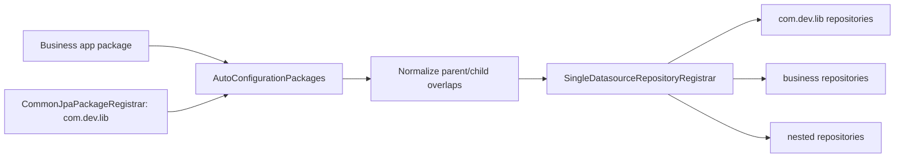

# Common Data JPA Repository Scan Implementation Plan

> **For Claude:** REQUIRED SUB-SKILL: Use superpowers:executing-plans to implement this plan task-by-task.

**Goal:** Make `common-data-jpa` the single repository registration owner for all classpath `com.dev.lib` repositories and business application repositories, including nested repository interfaces.

**Architecture:** `CommonJpaPackageRegistrar` contributes the common-lib root package to Spring Boot auto-configuration packages. `SingleDatasourceRepositoryRegistrar` consumes all auto-configuration packages, normalizes overlaps, and registers repositories with nested repository support enabled. Feature modules such as `common-aksk` do not self-register JPA packages.

**Tech Stack:** Java 25, Spring Boot 4.1 RC, Spring Data JPA repository registrar APIs, Maven, JUnit 5, AssertJ.

---

## Requirements Confirmed

- `common-data-jpa` must register every repository under `com.dev.lib` that is present on the runtime classpath.
- `common-data-jpa` must also register business repositories from application packages such as `com.x.y`, `cn.a.b`, and `com.ware4u.datalake`.
- Nested repository interfaces must be supported for both common-lib and business packages.
- `common-aksk` must not own JPA package or repository registration.
- If a common-lib module has a repository and is on the classpath, registering it is required behavior; there is no opt-out risk to mitigate for this change.

## Design

## Tasks

### Task 1: Prove Common-Lib Root Repository Registration

**Files:**
- Modify: `common-data-jpa/src/test/java/org/example/commonlib/jpa/CommonJpaRepositoryAutoScanTest.java`
- Create: `common-data-jpa/src/test/java/com/dev/lib/testsupport/repository/CommonLibNestedLedger.java`

**Steps:**
1. Restore the assertion that `OperateLogRepo` from `com.dev.lib.jpa.entity.log` is registered.
2. Add a common-lib-package nested repository fixture and assert `CommonLibNestedLedger.Mapper` is registered.
3. Run `JAVA_HOME=$(/usr/libexec/java_home -v 25) mvn -pl common-data-jpa -Dtest=CommonJpaRepositoryAutoScanTest test`.
4. Expected RED: test fails because the current scanner does not register common-lib nested repositories under `com.dev.lib`.

### Task 2: Register Common-Lib And Business Packages Together

**Files:**
- Modify: `common-data-jpa/src/main/java/com/dev/lib/jpa/multiple/SingleDatasourceRepositoryRegistrar.java`

**Steps:**
1. Remove the filter that excludes exact `com.dev.lib`.
2. Merge all `AutoConfigurationPackages` and existing internal repository packages.
3. Normalize parent/child overlaps so `com.dev.lib` wins over `com.dev.lib.aksk` and duplicate scans do not happen.
4. Register repositories once with `considerNestedRepositories=true`.
5. Run the Task 1 command and expect GREEN.

### Task 3: Remove AK/SK JPA Self-Registration

**Files:**
- Delete: `common-aksk/src/main/java/com/dev/lib/aksk/config/AkskAutoConfiguration.java`
- Delete: `common-aksk/src/main/resources/META-INF/spring/org.springframework.boot.autoconfigure.AutoConfiguration.imports`

**Steps:**
1. Delete the AK/SK auto-configuration registrar and imports file.
2. Run `JAVA_HOME=$(/usr/libexec/java_home -v 25) mvn -pl common-aksk -am -Dtest=AkskRepositoryAutoConfigurationIntegrationTest -Dsurefire.failIfNoSpecifiedTests=false test`.
3. Expected GREEN: `AkskCredential.Mapper` is registered by `common-data-jpa` through `com.dev.lib`.

### Task 4: Full Verification

**Commands:**
- `JAVA_HOME=$(/usr/libexec/java_home -v 25) mvn -pl common-data-jpa -Dtest=CommonJpaRepositoryAutoScanTest,NestedRepositoryAutoConfigurationIntegrationTest test`
- `JAVA_HOME=$(/usr/libexec/java_home -v 25) mvn -pl common-data-jpa -Dtest=NestedMultiDatasourceRepositoryIntegrationTest test`
- `JAVA_HOME=$(/usr/libexec/java_home -v 25) mvn -pl common-aksk -am -Dtest=AkskRepositoryAutoConfigurationIntegrationTest -Dsurefire.failIfNoSpecifiedTests=false test`
- `JAVA_HOME=$(/usr/libexec/java_home -v 25) mvn -pl common-aksk -am test`
- `git diff --check`

## Checkpoints

- Checkpoint 1: Common-lib root nested repository test fails for the current scanner.
- Checkpoint 2: Common-lib and business repository scan test passes after scanner change.
- Checkpoint 3: AK/SK mapper still registers after removing AK/SK self-registration.
- Checkpoint 4: Full verification passes.

## Execution Progress

Last updated: 2026-05-08 15:12 Asia/Shanghai.

- Task 1 RED complete. Added `com.dev.lib.testsupport.repository.CommonLibNestedLedger.Mapper` assertion to `CommonJpaRepositoryAutoScanTest`.
- Evidence: `JAVA_HOME=$(/usr/libexec/java_home -v 25) mvn -pl common-data-jpa -Dtest=CommonJpaRepositoryAutoScanTest test` failed because no bean of type `CommonLibNestedLedger.Mapper` was registered.
- Task 2 GREEN complete. `SingleDatasourceRepositoryRegistrar` now keeps `com.dev.lib`, merges internal repository packages into the same normalized package list, and registers repositories once with nested support enabled.
- Test-classpath adjustment: test-only repository type-token interfaces in `BaseRepositoryFactoryBeanPostProcessorTest` are marked `@NoRepositoryBean` so broad `com.dev.lib` scanning does not bootstrap them as real repositories.
- Evidence: `JAVA_HOME=$(/usr/libexec/java_home -v 25) mvn -pl common-data-jpa -Dtest=CommonJpaRepositoryAutoScanTest test` passed.
- Task 3 GREEN complete. Removed `common-aksk` JPA auto-configuration class and imports resource; AK/SK mapper registration still comes from `common-data-jpa` when verified in the reactor.
- Evidence: `JAVA_HOME=$(/usr/libexec/java_home -v 25) mvn -pl common-aksk -am -Dtest=AkskRepositoryAutoConfigurationIntegrationTest -Dsurefire.failIfNoSpecifiedTests=false test` passed.
- Note: `mvn -pl common-aksk ...` without `-am` used the stale installed `common-data-jpa` and failed, so AK/SK verification must be reactor-aware until the updated JPA module is installed.
- Task 4 final verification complete.
- Evidence: `JAVA_HOME=$(/usr/libexec/java_home -v 25) mvn -pl common-data-jpa -Dtest=CommonJpaRepositoryAutoScanTest,NestedRepositoryAutoConfigurationIntegrationTest test` passed with 2 tests.
- Evidence: `JAVA_HOME=$(/usr/libexec/java_home -v 25) mvn -pl common-data-jpa -Dtest=NestedMultiDatasourceRepositoryIntegrationTest test` passed with 1 test.
- Evidence: `JAVA_HOME=$(/usr/libexec/java_home -v 25) mvn -pl common-aksk -am -Dtest=AkskRepositoryAutoConfigurationIntegrationTest -Dsurefire.failIfNoSpecifiedTests=false test` passed.
- Evidence: `JAVA_HOME=$(/usr/libexec/java_home -v 25) mvn -pl common-aksk -am test` passed; `common-data-jpa` ran 108 tests and `common-aksk` ran 44 tests.
- Evidence: `git diff --check` passed.
- Local install: `JAVA_HOME=$(/usr/libexec/java_home -v 25) mvn -pl common-data-jpa,common-aksk -am install -DskipTests` passed and installed updated `1.5.3-RC1` jars into `~/.m2`.
- Installed jar check: `common-aksk-1.5.3-RC1.jar` no longer contains `AkskAutoConfiguration` or `META-INF/spring/org.springframework.boot.autoconfigure.AutoConfiguration.imports`; installed `common-data-jpa` contains the merged package scanner.
- Datalake startup check: `JAVA_HOME=$(/usr/libexec/java_home -v 25) mvn -pl datalake-server spring-boot:run -Dspring-boot.run.profiles=dev` still blocks before application startup while resolving `com.ware4u:datalake-bom:1.0` as `datalake-bom-1.0.jar` from `http://10.10.24.243:8081/repository/maven-public/`, so it cannot validate the Spring context in this session.
