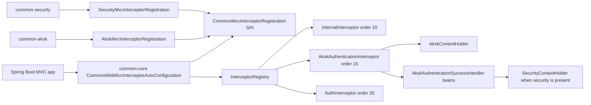
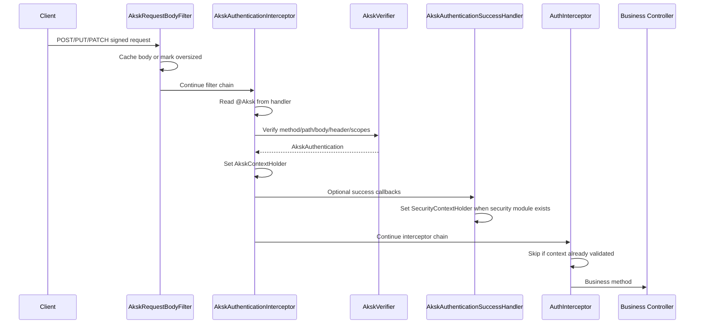

# Core Interceptor Hook Implementation Plan

> **For Claude:** REQUIRED SUB-SKILL: Use superpowers:executing-plans to implement this plan task-by-task.

**Goal:** Move Spring MVC interceptor registration to a `common-core` extension hook so `common-aksk` can protect `@Aksk` endpoints without requiring `common-security`.

**Architecture:** `common-core` owns a small interceptor registration SPI and a single MVC configurer that invokes SPI beans in order. `common-aksk` owns AK/SK request body caching, `@Aksk` detection, signature verification, and `AkskContextHolder`; `common-security` owns internal/token auth interceptors and optionally adapts successful AK/SK authentication into `SecurityContextHolder`.

**Tech Stack:** Java 25, Spring Boot 4.1 RC auto-configuration, Spring MVC `HandlerInterceptor`/`WebMvcConfigurer`, servlet filters, Maven/JUnit/AssertJ.

---

## Requirements Confirmed

Confirmed on 2026-05-09 by user reply `yes`.

We are solving the production bug where a service that depends on `common-aksk` directly can compile `@Aksk` annotations but receives no request-time verification because the current AK/SK MVC interceptor lives in `common-security`.

### Functional Requirements

- `common-core` provides the common interceptor registration hook.
- `common-aksk` registers its own AK/SK interceptor through the core hook.
- `common-aksk` registers request body caching for POST/PUT/PATCH so signature verification does not consume the business request body.
- `common-security` registers only its own internal/auth interceptors through the same core hook.
- If both `common-aksk` and `common-security` are present, AK/SK authentication must still run before normal auth, and successful AK/SK requests must satisfy `AuthInterceptor` by writing a validated user into `SecurityContextHolder`.
- If only `common-aksk` is present, `@Aksk` endpoints must still be verified and `AkskContextHolder` must be populated.
- Unannotated endpoints must not trigger AK/SK verification.
- `/admin/**` behavior from `common-security` remains unchanged: admin role is required, and whitelist/`@Anonymous` must not bypass it.

### Non-Functional Requirements

- Keep dependency direction clean: `common-core` must not depend on `common-aksk` or `common-security`.
- Do not create duplicate interceptor registrations when `common-starter` component scans `com.dev.lib` and Spring Boot auto-configuration also sees library metadata.
- Keep existing interceptor order semantics:
  - internal auth: `10`
  - AK/SK auth: `15`
  - token/permission auth: `20`
- Keep body cache size enforcement using `app.aksk.max-cached-body-bytes`.
- Use TDD: each behavior change starts with a failing test.

### Edge Cases

- `HandlerMethod` absent: AK/SK interceptor must ignore the request.
- Missing `@Aksk`: verifier must not be called.
- Method-level `@Aksk` overrides class-level `@Aksk`.
- Oversized request body: AK/SK endpoint fails with `REQUEST_BODY_INVALID` before verifier/business logic.
- Failed signature/scope verification must not leave stale `AkskContextHolder` or `SecurityContextHolder` state.
- `common-security` absent: no class from `common-security` can be required to start AK/SK interception.
- `common-aksk` absent: `common-security` must still register internal/auth interceptors and start.

---

## Technical Design



### Component Responsibilities

- `common-core`
  - Defines `CommonMvcInterceptorRegistration`.
  - Provides one servlet MVC configurer that iterates `CommonMvcInterceptorRegistration` beans with Spring ordering.
  - Does not know about AK/SK, tokens, permissions, or paths.

- `common-aksk`
  - Owns `AkskAuthenticationInterceptor`.
  - Owns `AkskRequestBodyFilter` and `CachedBodyHttpServletRequest`.
  - Defines `AkskAuthenticationSuccessHandler` as an optional callback.
  - Registers AK/SK interceptor with `order(15)` and `/**`.
  - Keeps `AkskContextHolder` cleanup in `afterCompletion`.

- `common-security`
  - Owns `InternalInterceptor`, `AuthInterceptor`, and `PermissionValidator`.
  - Registers internal/auth interceptors with the existing `/api/**` and `/admin/**` patterns.
  - Provides an `AkskAuthenticationSuccessHandler` implementation that converts AK/SK authentication into `SecurityContextHolder` using the existing `AkskSecurityContextAdapter`.
  - No longer registers the AK/SK interceptor itself.

### Data Flow



### Risk Assessment

- **Risk:** Adding Web MVC classes to `common-core` may break non-web applications.
  - **Mitigation:** Keep config conditional on servlet web infrastructure and test context startup.
- **Risk:** `common-starter` component scan plus auto-configuration can duplicate beans.
  - **Mitigation:** Use `@ConditionalOnMissingBean` on auto-configured beans and add context tests that include both paths where feasible.
- **Risk:** Moving classes from `common-security` to `common-aksk` can break existing imports.
  - **Mitigation:** Prefer adding new AK/SK package classes and updating internal tests; only delete old security-owned AK/SK classes once no production references remain.
- **Risk:** If AK/SK no longer writes `SecurityContextHolder`, `AuthInterceptor` will reject signed `/api/**` requests.
  - **Mitigation:** Add a `common-security` success handler test proving AK/SK success produces a validated `SecurityContextHolder` user.
- **Risk:** Body caching in `common-aksk` registers too broadly.
  - **Mitigation:** Preserve existing method and size checks; add tests for repeated body reads and oversized skip.

---

## Execution Progress

Last updated: 2026-05-09 15:31 Asia/Shanghai.

Current checkpoint: Task 6 verification and documentation complete. The plan is ready for final memory compaction.

Completed tasks:

- Task 1: Core interceptor registration hook.
- Task 2: Move AK/SK web runtime into `common-aksk`.
- Task 3: `common-aksk` auto-configuration.
- Task 4: Refactor `common-security` to use the core hook and AK/SK success handler.
- Task 5: Clean up old `common-security` AK/SK classes as deprecated bridges.
- Task 6: Final verification and documentation.

Verification evidence so far:

- Code inspection confirmed `@Aksk` lives in `common-aksk`, while the current verifier-calling `AkskAuthenticationInterceptor` and MVC registration live in `common-security`.
- Code inspection confirmed `common-core` already compiles against Spring MVC types through inherited provided dependencies, but has no independent auto-configuration import file.
- Task 1 RED: `JAVA_HOME=$(/usr/libexec/java_home -v 25) mvn -pl common-core -Dtest=CommonWebMvcInterceptorAutoConfigurationTest test` -> failed at test compile because `com.dev.lib.web.interceptor.CommonMvcInterceptorRegistration` did not exist.
- Task 1 first GREEN attempt: same command -> failed at compile because `WebMvcConfigurer` is not a functional interface; implementation was corrected to an anonymous `WebMvcConfigurer`.
- Task 1 second GREEN attempt: same command -> 1 test passed, BUILD SUCCESS.
- Task 2 RED: `JAVA_HOME=$(/usr/libexec/java_home -v 25) mvn -pl common-aksk -Dtest=AkskAuthenticationInterceptorTest,AkskWebMvcRegistrationTest test` -> failed at test compile because `AkskAuthenticationInterceptor` and `AkskAuthenticationSuccessHandler` did not exist in `common-aksk`.
- Task 2 GREEN: `JAVA_HOME=$(/usr/libexec/java_home -v 25) mvn -pl common-aksk -am -Dtest=AkskAuthenticationInterceptorTest,AkskWebMvcRegistrationTest -Dsurefire.failIfNoSpecifiedTests=false test` -> 11 tests passed, reactor BUILD SUCCESS.
- Task 2 dependency-direction check: `rg -n "common-security|com\\.dev\\.lib\\.security\\.(aksk|interceptor|config|service)|SecurityContextHolder" common-aksk/src/main/java common-aksk/src/test/java` -> no matches.
- Task 3 RED: `JAVA_HOME=$(/usr/libexec/java_home -v 25) mvn -pl common-aksk -am -Dtest=AkskWebAutoConfigurationIntegrationTest,AkskRepositoryAutoConfigurationIntegrationTest -Dsurefire.failIfNoSpecifiedTests=false test` -> failed because the non-`com.dev.lib` test application had no `AkskAuthenticationInterceptor` bean.
- Task 3 GREEN: same command -> 2 tests passed, reactor BUILD SUCCESS.
- Task 3 dependency decision: `common-aksk` now depends transitively on `common-data-jpa`; the previous optional dependency would prevent a downstream service that declares only `common-aksk` from receiving the credential repository runtime.
- Task 4 RED: `JAVA_HOME=$(/usr/libexec/java_home -v 25) mvn -pl common-security -am -Dtest=AdminPathSecurityTest,AkskSecurityIntegrationTest,AkskAuthenticationInterceptorTest -Dsurefire.failIfNoSpecifiedTests=false test` -> failed at test compile because `SecurityMvcInterceptorRegistration` and `SecurityAkskAuthenticationSuccessHandler` did not exist.
- Task 4 first GREEN attempt: same command -> failed at test compile because the local AssertJ version does not have `ClassAssert.doesNotHaveAnnotation`; test assertion was corrected to `isAnnotationPresent(...).isFalse()`.
- Task 4 GREEN: same command -> 13 `common-security` tests passed, 0 failures, reactor BUILD SUCCESS.
- Task 5 reference search: `rg -n "com\\.dev\\.lib\\.security\\.(interceptor\\.AkskAuthenticationInterceptor|aksk\\.AkskRequestBodyFilter|aksk\\.CachedBodyHttpServletRequest)|security\\.interceptor\\.AkskAuthenticationInterceptor|security\\.aksk\\.AkskRequestBodyFilter|security\\.aksk\\.CachedBodyHttpServletRequest" common-* docs memory.md` -> no production references outside the bridge/test files.
- Task 5 RED: `JAVA_HOME=$(/usr/libexec/java_home -v 25) mvn -pl common-security -am -Dtest=AkskSecurityIntegrationTest -Dsurefire.failIfNoSpecifiedTests=false test` -> failed because the old security AK/SK interceptor was not assignable from the new `common-aksk` interceptor.
- Task 5 GREEN: same command -> 5 tests passed, 0 failures, reactor BUILD SUCCESS.
- Task 5 targeted compile: `JAVA_HOME=$(/usr/libexec/java_home -v 25) mvn -pl common-aksk,common-security -am test -DskipTests` -> reactor BUILD SUCCESS.
- Task 5 security regression: `JAVA_HOME=$(/usr/libexec/java_home -v 25) mvn -pl common-security -am -Dtest=AdminPathSecurityTest,AkskSecurityIntegrationTest,AkskAuthenticationInterceptorTest -Dsurefire.failIfNoSpecifiedTests=false test` -> 14 common-security tests passed, 0 failures, reactor BUILD SUCCESS.
- Task 6 core verification: `JAVA_HOME=$(/usr/libexec/java_home -v 25) mvn -pl common-core test` -> 21 tests passed, 0 failures, BUILD SUCCESS.
- Task 6 original AK/SK command deviation: `JAVA_HOME=$(/usr/libexec/java_home -v 25) mvn -pl common-aksk test` failed because Maven resolved a stale local `common-core:1.6.0` artifact that did not contain `CommonMvcInterceptorRegistration`; the root cause is that the command did not include changed reactor dependencies.
- Task 6 AK/SK verification: `JAVA_HOME=$(/usr/libexec/java_home -v 25) mvn -pl common-aksk -am test` -> 57 `common-aksk` tests passed, 0 failures, reactor BUILD SUCCESS.
- Task 6 security verification: `JAVA_HOME=$(/usr/libexec/java_home -v 25) mvn -pl common-security -am test` -> 14 `common-security` tests passed, 0 failures, reactor BUILD SUCCESS.
- Post-completion correction: removed the redundant `common-aksk` JPA package registrar. `common-aksk` now relies on `common-data-jpa`'s `CommonJpaPackageRegistrar` registering `com.dev.lib`; `AkskRepositoryAutoConfigurationIntegrationTest` asserts `AkskCredential.Mapper` is registered without `com.dev.lib.aksk` being added separately.
- Post-completion verification: `JAVA_HOME=$(/usr/libexec/java_home -v 25) mvn -pl common-aksk -am test` -> 57 `common-aksk` tests passed, 0 failures, reactor BUILD SUCCESS.

---

## Task 1: Core Interceptor Registration Hook

**Files:**

- Create: `common-core/src/main/java/com/dev/lib/web/interceptor/CommonMvcInterceptorRegistration.java`
- Create: `common-core/src/main/java/com/dev/lib/config/CommonWebMvcInterceptorAutoConfiguration.java`
- Create: `common-core/src/main/resources/META-INF/spring/org.springframework.boot.autoconfigure.AutoConfiguration.imports`
- Create: `common-core/src/test/java/com/dev/lib/config/CommonWebMvcInterceptorAutoConfigurationTest.java`

**Step 1: Write failing test**

Add a test proving a `CommonMvcInterceptorRegistration` bean is called by the core MVC configurer and can add a mapped interceptor.

Expected RED: compile fails because `CommonMvcInterceptorRegistration` and `CommonWebMvcInterceptorAutoConfiguration` do not exist.

**Step 2: Run RED**

```bash
JAVA_HOME=$(/usr/libexec/java_home -v 25) mvn -pl common-core -Dtest=CommonWebMvcInterceptorAutoConfigurationTest test
```

**Step 3: Implement minimal core hook**

Create:

```java
package com.dev.lib.web.interceptor;

import org.springframework.web.servlet.config.annotation.InterceptorRegistry;

@FunctionalInterface
public interface CommonMvcInterceptorRegistration {

    void addInterceptors(InterceptorRegistry registry);
}
```

Create an auto-configuration that implements `WebMvcConfigurer`, injects `ObjectProvider<CommonMvcInterceptorRegistration>`, and calls `orderedStream()` in `addInterceptors`.

**Step 4: Run GREEN**

```bash
JAVA_HOME=$(/usr/libexec/java_home -v 25) mvn -pl common-core -Dtest=CommonWebMvcInterceptorAutoConfigurationTest test
```

**Checkpoint:** Stop if this creates duplicate configurer beans under the test context.

**Result:** Complete. The test uses `WebApplicationContextRunner`, registers two `CommonMvcInterceptorRegistration` beans, and proves the core `WebMvcConfigurer` applies them in Spring order.

---

## Task 2: Move AK/SK Web Runtime Into common-aksk

**Files:**

- Create: `common-aksk/src/main/java/com/dev/lib/aksk/web/AkskAuthenticationInterceptor.java`
- Create: `common-aksk/src/main/java/com/dev/lib/aksk/web/AkskAuthenticationSuccessHandler.java`
- Create: `common-aksk/src/main/java/com/dev/lib/aksk/web/AkskMvcInterceptorRegistration.java`
- Create: `common-aksk/src/main/java/com/dev/lib/aksk/web/AkskRequestBodyFilter.java`
- Create: `common-aksk/src/main/java/com/dev/lib/aksk/web/CachedBodyHttpServletRequest.java`
- Create: `common-aksk/src/test/java/com/dev/lib/aksk/web/AkskAuthenticationInterceptorTest.java`
- Create: `common-aksk/src/test/java/com/dev/lib/aksk/web/AkskWebMvcRegistrationTest.java`
- Modify: `common-aksk/pom.xml`
- Modify: `common-aksk/README.md`

**Step 1: Write failing tests**

Add tests in `common-aksk` proving:

- unannotated endpoints are ignored;
- method/class `@Aksk` endpoints call verifier;
- successful verification sets `AkskContextHolder`;
- success handlers are invoked;
- oversized body fails before verifier;
- AK/SK interceptor registers on `/**` with order `15`;
- request body filter preserves repeated reads.

Expected RED: compile fails because AK/SK web classes do not exist in `common-aksk`.

**Step 2: Run RED**

```bash
JAVA_HOME=$(/usr/libexec/java_home -v 25) mvn -pl common-aksk -Dtest=AkskAuthenticationInterceptorTest,AkskWebMvcRegistrationTest test
```

**Step 3: Implement AK/SK web classes**

Move behavior from current `common-security` AK/SK classes into `common-aksk` package `com.dev.lib.aksk.web`.

`AkskAuthenticationInterceptor` must:

- resolve method-level annotation before class-level annotation;
- build `AkskVerificationRequest`;
- reject oversized body marker with `REQUEST_BODY_INVALID`;
- set `AkskContextHolder`;
- invoke ordered `AkskAuthenticationSuccessHandler` beans;
- clear only `AkskContextHolder` in `afterCompletion`.

**Step 4: Run GREEN**

```bash
JAVA_HOME=$(/usr/libexec/java_home -v 25) mvn -pl common-aksk -Dtest=AkskAuthenticationInterceptorTest,AkskWebMvcRegistrationTest test
```

**Checkpoint:** Stop if `common-aksk` cannot compile without `common-security`.

**Result:** Complete. `common-aksk` now owns `AkskAuthenticationInterceptor`, `AkskAuthenticationSuccessHandler`, `AkskMvcInterceptorRegistration`, `AkskRequestBodyFilter`, and `CachedBodyHttpServletRequest`. GREEN used `-am` because the new registration depends on the in-workspace `common-core` SPI from Task 1.

---

## Task 3: common-aksk Auto-Configuration

**Files:**

- Create: `common-aksk/src/main/java/com/dev/lib/aksk/config/AkskAutoConfiguration.java`
- Create: `common-aksk/src/main/java/com/dev/lib/aksk/config/AkskJpaPackageRegistrar.java`
- Create: `common-aksk/src/main/resources/META-INF/spring/org.springframework.boot.autoconfigure.AutoConfiguration.imports`
- Create: `common-aksk/src/test/java/org/example/commonlib/aksk/AkskWebAutoConfigurationIntegrationTest.java`
- Modify: `common-aksk/src/test/java/org/example/commonlib/aksk/AkskRepositoryAutoConfigurationIntegrationTest.java`
- Modify: `common-aksk/pom.xml`

**Step 1: Write failing integration test**

Add a non-`com.dev.lib` application context test proving that when only `common-aksk` auto-configuration is loaded:

- `AkskAuthenticationInterceptor` exists;
- `AkskMvcInterceptorRegistration` exists;
- `AkskRequestBodyFilter` exists;
- `AkskCredential.Mapper` remains registered.

Expected RED: context does not contain AK/SK web registration beans.

**Step 2: Run RED**

```bash
JAVA_HOME=$(/usr/libexec/java_home -v 25) mvn -pl common-aksk -Dtest=AkskWebAutoConfigurationIntegrationTest,AkskRepositoryAutoConfigurationIntegrationTest test
```

**Step 3: Implement auto-configuration**

Create `AkskAutoConfiguration` with `@AutoConfiguration`, `@EnableConfigurationProperties(AkskProperties.class)`, and `@Bean @ConditionalOnMissingBean` methods for AK/SK services and web registration components that are not already component-scanned.

If repository auto-package registration is still missing from source, restore it here so business services do not need `@EntityScan` or manual JPA repository scanning.

**Step 4: Run GREEN**

```bash
JAVA_HOME=$(/usr/libexec/java_home -v 25) mvn -pl common-aksk -Dtest=AkskWebAutoConfigurationIntegrationTest,AkskRepositoryAutoConfigurationIntegrationTest test
```

**Checkpoint:** Stop if common-starter component scanning plus AK/SK auto-configuration creates duplicate bean definitions.

**Result:** Complete. `AkskWebAutoConfigurationIntegrationTest` proves a business application outside `com.dev.lib` receives `AkskCredential.Mapper`, `AkskAuthenticationInterceptor`, `AkskMvcInterceptorRegistration`, `AkskRequestBodyFilter`, and the core `CommonMvcInterceptorRegistration` bean through auto-configuration.

---

## Task 4: Refactor common-security To Use The Core Hook

**Files:**

- Create: `common-security/src/main/java/com/dev/lib/security/config/SecurityMvcInterceptorRegistration.java`
- Create: `common-security/src/main/java/com/dev/lib/security/aksk/SecurityAkskAuthenticationSuccessHandler.java`
- Modify: `common-security/src/main/java/com/dev/lib/security/config/WebSecurityConfig.java`
- Modify: `common-security/src/test/java/com/dev/lib/security/interceptor/AdminPathSecurityTest.java`
- Modify: `common-security/src/test/java/com/dev/lib/security/interceptor/AkskSecurityIntegrationTest.java`
- Modify: `common-security/src/test/java/com/dev/lib/security/interceptor/AkskAuthenticationInterceptorTest.java` or move remaining AK/SK interceptor tests to `common-aksk`

**Step 1: Write failing security tests**

Update tests to prove:

- security registration adds only internal/auth interceptors;
- internal/auth patterns and order are unchanged;
- AK/SK success handler writes `SecurityContextHolder`;
- AK/SK interceptor itself is no longer owned by `common-security`.

Expected RED: tests fail because current `WebSecurityConfig` directly registers AK/SK and the success handler does not exist.

**Step 2: Run RED**

```bash
JAVA_HOME=$(/usr/libexec/java_home -v 25) mvn -pl common-security -am -Dtest=AdminPathSecurityTest,AkskSecurityIntegrationTest,AkskAuthenticationInterceptorTest -Dsurefire.failIfNoSpecifiedTests=false test
```

**Step 3: Implement security hook registration**

Make `WebSecurityConfig` either delegate to or become a `CommonMvcInterceptorRegistration` for only:

- `InternalInterceptor`, order `10`, include `/api/**`, `/admin/**`, exclude `/api/auth/**`, `/api/public/**`;
- `AuthInterceptor`, order `20`, include `/api/**`, `/admin/**`, exclude `/api/auth/**`, `/api/public/**`.

Create `SecurityAkskAuthenticationSuccessHandler` that implements `AkskAuthenticationSuccessHandler` and uses `AkskSecurityContextAdapter` to write `SecurityContextHolder`.

**Step 4: Run GREEN**

```bash
JAVA_HOME=$(/usr/libexec/java_home -v 25) mvn -pl common-security -am -Dtest=AdminPathSecurityTest,AkskSecurityIntegrationTest,AkskAuthenticationInterceptorTest -Dsurefire.failIfNoSpecifiedTests=false test
```

**Checkpoint:** Stop if signed `/api/**` requests can no longer satisfy `AuthInterceptor`.

**Result:** Complete. `SecurityMvcInterceptorRegistration` implements the core hook and registers only `InternalInterceptor` at order `10` and `AuthInterceptor` at order `20`, preserving `/api/**` and `/admin/**` include/exclude patterns. `SecurityAkskAuthenticationSuccessHandler` implements `AkskAuthenticationSuccessHandler` and writes an adapted validated AK/SK user into `SecurityContextHolder`. The old security-owned AK/SK interceptor and body filter remain as source-compatible classes for Task 5 cleanup, but they are no longer Spring components.

---

## Task 5: Clean Up Old AK/SK Classes In common-security

**Files:**

- Delete or deprecate: `common-security/src/main/java/com/dev/lib/security/interceptor/AkskAuthenticationInterceptor.java`
- Delete or deprecate: `common-security/src/main/java/com/dev/lib/security/aksk/AkskRequestBodyFilter.java`
- Delete or deprecate: `common-security/src/main/java/com/dev/lib/security/aksk/CachedBodyHttpServletRequest.java`
- Modify: `common-security/src/test/java/...` imports as needed
- Modify: `common-aksk/README.md`

**Step 1: Search references**

```bash
rg -n "com\\.dev\\.lib\\.security\\.(interceptor\\.AkskAuthenticationInterceptor|aksk\\.AkskRequestBodyFilter|aksk\\.CachedBodyHttpServletRequest)|AkskAuthenticationInterceptor|AkskRequestBodyFilter|CachedBodyHttpServletRequest" common-* docs
```

**Step 2: Remove or bridge**

If only internal tests reference old classes, delete them. If production compatibility is required, keep deprecated bridge classes that extend the new `common-aksk` classes without registering duplicate beans.

**Step 3: Run targeted compile**

```bash
JAVA_HOME=$(/usr/libexec/java_home -v 25) mvn -pl common-aksk,common-security -am test -DskipTests
```

**Checkpoint:** Stop if deleting classes breaks public compatibility we decide to preserve.

**Result:** Complete. The old `common-security` AK/SK interceptor, body filter, and cached request classes remain available as `@Deprecated(forRemoval = true)` bridges to the new `common-aksk` runtime. They are not Spring components, so they do not create duplicate runtime registration, but existing source imports still compile during the migration window.

---

## Task 6: Final Verification And Documentation

**Files:**

- Modify: `common-aksk/README.md`
- Modify: `docs/plans/2026-05-09-core-interceptor-hook-implementation-plan.md`
- Modify: `memory.md`

**Step 1: Run module suites**

```bash
JAVA_HOME=$(/usr/libexec/java_home -v 25) mvn -pl common-core test
JAVA_HOME=$(/usr/libexec/java_home -v 25) mvn -pl common-aksk -am test
JAVA_HOME=$(/usr/libexec/java_home -v 25) mvn -pl common-security -am test
git diff --check
```

**Step 2: Update documentation**

Document that:

- `common-aksk` alone is enough for `@Aksk` verification;
- `common-security` is only required when token/admin/permission security is needed;
- both modules use the `common-core` interceptor hook.

**Step 3: Update memory**

After all tasks complete and final verification passes, replace `memory.md` with exactly one sentence summarizing the completed work.

**Result:** Complete. `common-aksk/README.md` now documents that `common-aksk` alone verifies `@Aksk` endpoints through the `common-core` hook, while `common-security` is only needed for token/admin/permission behavior and `SecurityContextHolder` integration.

---

## Checkpoint Protocol

Stop after Task 1, Task 3, and Task 4 with evidence:

```text
CHECKPOINT: [Component Name]

Completed:
- [Concrete deliverable]

Evidence:
- Tests: X/Y passed
- Build: PASS/FAIL

Next Steps:
- [Specific action]

Proceed? (yes/no/revise)
```
