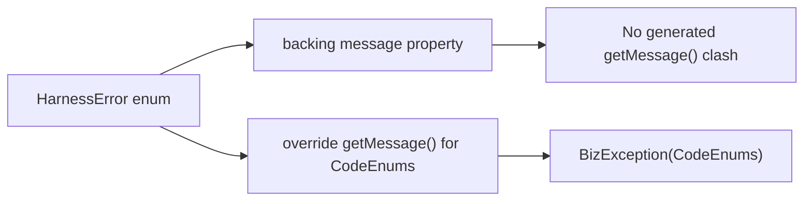

# Common Agent HarnessError Build Fix Implementation Plan

> **For Claude:** REQUIRED SUB-SKILL: Use superpowers:executing-plans to implement this plan task-by-task.

**Goal:** Fix the `common-agent` build failure caused by the `HarnessError` Kotlin/JVM method signature clash while preserving `CodeEnums` and `BizException` behavior.

**Architecture:** Keep the fix local to `common-agent` by preserving `HarnessError` as the `CodeEnums` adapter and removing the duplicate JVM `getMessage()` generation path. Add a small regression test that proves the enum still exposes code and message values through the shared exception contract.

**Tech Stack:** Kotlin, Java 25, Maven, JUnit 5, Spring Boot test dependencies.

---

## Requirements Confirmed

Confirmed on 2026-05-15 from the build log and local code inspection.

### Functional Requirements

- `common-agent` must compile successfully after the fix.
- `HarnessError` must continue to satisfy `CodeEnums`.
- `HarnessException(error)` must continue to produce the same business code and message through `BizException`.

### Non-Functional Requirements

- Keep the fix minimal and local to the current build blocker.
- Do not revert or reshape unrelated in-progress `common-agent` changes.
- Add a regression test so this specific JVM signature clash does not return silently.

### Edge Cases

- Kotlin property accessors must not collide with manually overridden Java-style getters.
- The fix must preserve `getMessage()` output even if the internal backing property name changes.

---

## Technical Design



### Risk Assessment

- **Risk:** Changing enum property names could affect call sites.
  - **Mitigation:** Keep constructor semantics the same and add a regression test around `HarnessException`.
- **Risk:** Targeted verification may use the wrong JDK.
  - **Mitigation:** Pin verification commands with `JAVA_HOME=$(/usr/libexec/java_home -v 25)`.

---

## Execution Progress

Last updated: 2026-05-15 Asia/Shanghai.

Current checkpoint: All planned tasks complete.

Verification evidence so far:

- Original IDE-driven reactor build failed in `common-agent` with `Platform declaration clash` in `HarnessError.kt`.
- Local first-pass reproduction without pinning JDK 25 failed earlier in `common-core` with `release 25 not supported`, confirming environment-sensitive verification.
- Fresh JDK 25 reproduction against the current worktree: `JAVA_HOME=$(/usr/libexec/java_home -v 25) mvn -pl common-agent -am -DskipTests=true compile` initially failed in `common-agent` with `Accidental override` on `getMessage()`.
- Post-fix verification: `JAVA_HOME=$(/usr/libexec/java_home -v 25) mvn -pl common-agent -am -Dtest=SaaResponseEventAdapterTest -Dsurefire.failIfNoSpecifiedTests=false test` -> 1 test passed, reactor BUILD SUCCESS.

---

### Task 1: Add regression test for the exception contract

**Files:**

- Modify: `common-agent/src/test/java/com/dev/lib/harness/protocol/SaaResponseEventAdapterTest.kt`

**Step 1: Write the failing test**

Add a test that constructs a `HarnessException` from a `HarnessError` constant and asserts the code/message exposed by `BizException`.

**Step 2: Run test to verify current failure**

Run:

```bash
JAVA_HOME=$(/usr/libexec/java_home -v 25) mvn -pl common-agent -am -DskipTests=true compile
```

Expected: FAIL at Kotlin compile in `HarnessError.kt` with duplicate `getMessage()` JVM signature.

**Step 3: Keep the test in place for GREEN verification**

After the production fix, run:

```bash
JAVA_HOME=$(/usr/libexec/java_home -v 25) mvn -pl common-agent -am -Dtest=SaaResponseEventAdapterTest -Dsurefire.failIfNoSpecifiedTests=false test
```

Expected: PASS.

### Task 2: Remove the JVM signature clash with the smallest code change

**Files:**

- Modify: `common-agent/src/main/kotlin/com/dev/lib/harness/biz/HarnessError.kt`

**Step 1: Rename the backing property**

Change the enum constructor from `val message: String` to a non-conflicting backing property such as `val msg: String`.

**Step 2: Preserve the Java contract**

Keep:

```kotlin
override fun getMessage(): String = msg
```

so `CodeEnums` and `BizException` semantics stay unchanged.

### Task 3: Verify the fix with JDK 25

**Files:**

- No new files

**Step 1: Run targeted module compile**

```bash
JAVA_HOME=$(/usr/libexec/java_home -v 25) mvn -pl common-agent -am -DskipTests=true compile
```

Expected: BUILD SUCCESS.

**Step 2: Run the targeted regression test**

```bash
JAVA_HOME=$(/usr/libexec/java_home -v 25) mvn -pl common-agent -am -Dtest=SaaResponseEventAdapterTest -Dsurefire.failIfNoSpecifiedTests=false test
```

Expected: test passes and reactor BUILD SUCCESS.
