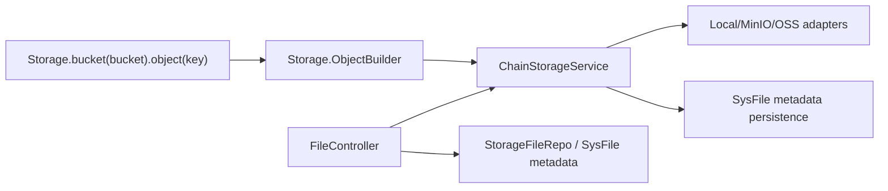

# Storage Remove VFS Implementation Plan

> **For Claude:** REQUIRED SUB-SKILL: Use superpowers:executing-plans to implement this plan task-by-task.

**Goal:** Remove the `common-bash` module and all VFS-related behavior from `common-storage`, while keeping and simplifying the `Storage.bucket(...).object(...).xx()` and `Storage.batch(...)` APIs.

**Architecture:** Collapse `common-storage` onto a single bucket/object-key storage model. Replace VFS-backed path, command, cleanup, and controller internals with direct `ChainStorageService` and `SysFile` metadata operations, so the public API stays chain-based but the internals no longer depend on virtual paths, shell-style commands, or VFS lifecycle state.

**Tech Stack:** Java 25, Spring Boot 4, Maven multi-module build, JPA repositories, existing storage adapters for local/MinIO/OSS.

---

## Requirements Confirmed

Confirmed on 2026-05-15 with the user.

### Functional Requirements

- Delete the entire `common-bash` module.
- Remove all VFS-related code from `common-storage`.
- Keep `Storage.bucket(...).object(...).xx()` chain-style operations.
- Keep `Storage.batch(...)`, but simplify the implementation.
- Keep `FileController`, but rewrite it to use storage metadata and direct storage access instead of VFS services.

### Non-Functional Requirements

- Reduce complexity instead of keeping VFS-shaped compatibility layers.
- Do not execute shell commands during implementation in this session.
- Keep the storage API production-safe with explicit validation and meaningful failure behavior.

### Confirmed Design Decisions

- `SysFile` should no longer store VFS-only fields such as `virtualPath`, `parentPath`, `isDirectory`, `hidden`, `oldStoragePaths`, and `deleteAfter`.
- The storage module should no longer contain VFS concepts, VFS commands, VFS cleanup jobs, or VFS path abstractions.
- `temporary`, `expirationAt`, VFS cleanup scheduling, and COW old-version cleanup will also be removed as part of the simplification.

### Edge Cases

- `bucketName` and `objectKey` must still reject blank values.
- Leading `/` and duplicated `bucketName/` prefixes in `objectKey` must continue to be normalized consistently.
- `FileController` must still handle missing file metadata, missing storage paths, and blank requested download names safely.
- Storage implementations must keep working for `local`, `minio`, and `oss` without VFS helper classes.

---

## Technical Design



### Component Responsibilities

- `Storage`: keep the public fluent API and input normalization.
- `ChainStorageService`: remain the runtime abstraction for upload, download, write, append, copy, delete, and presigned URL generation.
- `AbstractChainStorage` and concrete adapters: own direct metadata persistence for bucket/object-key records.
- `SysFile`: become a plain storage metadata record rather than a virtual filesystem node.
- `FileController`: resolve file metadata by `bizId` and stream or sign files by `bucketName` and `objectKey` derived from persisted metadata.

### Data Model Direction

- Replace virtual-path identity with explicit `bucketName` + `objectKey`.
- Keep `storagePath` only as the backend-specific storage locator when needed.
- Preserve `serviceName` scoping for multi-service isolation.
- Remove directory/file-tree semantics from the data layer.

### Risk Assessment

- **Risk:** Removing VFS fields changes the persisted schema and breaks any code relying on virtual-path lookups.
  - **Mitigation:** Static scan already shows no cross-module `Vfs.path(...)` usage outside the VFS and bash implementations themselves.
- **Risk:** COW removal changes overwrite semantics for concurrent readers.
  - **Mitigation:** Simplify writes to direct replacement and document that this trades old-version safety for a smaller, clearer storage core.
- **Risk:** `FileController` currently depends on a VFS-backed storage bridge.
  - **Mitigation:** Rewire it to direct `ChainStorageService` access via persisted `bucketName` and `objectKey`.

---

## Execution Progress

Last updated: 2026-05-15 Asia/Shanghai.

Current checkpoint: `common-bash` removed, storage metadata switched to bucket/object-key, `FileController` rewired away from VFS, and the VFS package tree deleted. Static cleanup and compile-risk review remain.

Verification evidence so far:

- Static scan found no non-storage, non-bash consumers of `Bash.exec(...)` or `Vfs.path(...)`.
- `common-bash` module entry and managed dependency were removed from the root reactor, and the module source tree was deleted.
- `SysFile` and `StorageFile` were reshaped from virtual-path metadata to `bucketName` + `objectKey` metadata.
- `FileController` now reads and signs files through `ChainStorageService` using persisted storage coordinates.
- VFS APIs, commands, virtual services, cleanup task, and VFS configuration blocks were deleted from `common-storage`.

---

### Task 1: Add characterization tests for the storage API surface

**Files:**

- Create: `common-storage/src/test/java/com/dev/lib/storage/StorageObjectBuilderTest.java`
- Create: `common-storage/src/test/java/com/dev/lib/storage/trigger/controller/FileControllerTest.java`

**Step 1: Write the failing tests**

- Test `Storage.bucket(...).object(...)` normalization and blank-input validation.
- Test `FileController` behavior for download filename resolution and presigned URL lookup without VFS services.

**Step 2: Verify tests fail for the right reason**

Expected: controller test fails because it still depends on a VFS service or old metadata shape.

### Task 2: Remove `common-bash` from the reactor

**Files:**

- Modify: `pom.xml`
- Delete: `common-bash/pom.xml`
- Delete: `common-bash/src/main/java/com/dev/lib/bash/**`

**Step 1: Remove module registration and dependency management entries**

- Delete the `common-bash` module entry from the root reactor.
- Delete any managed dependency entry for `common-bash`.

**Step 2: Remove the module sources**

- Delete the entire `common-bash` module directory.

Status: Completed.

### Task 3: Replace the VFS-shaped metadata model with storage metadata

**Files:**

- Modify: `common-storage/src/main/java/com/dev/lib/storage/data/SysFile.java`
- Modify: `common-storage/src/main/java/com/dev/lib/storage/domain/model/StorageFile.java`
- Modify: `common-storage/src/main/java/com/dev/lib/storage/serialize/FileItem.java`
- Modify: `common-storage/src/main/java/com/dev/lib/storage/data/SysFileBizIdRepository.java`
- Delete: `common-storage/src/main/java/com/dev/lib/storage/data/VfsPathRepository.java`

**Step 1: Remove VFS-only fields**

- Replace virtual-path and directory metadata with explicit `bucketName` and `objectKey`.
- Remove temporary/COW cleanup fields that only exist for the VFS lifecycle model.

**Step 2: Update repository queries**

- Keep `bizId` and `serviceName` lookup paths.
- Add or keep repository methods needed for `bucketName` + `objectKey` metadata persistence.

Status: Completed.

### Task 4: Rebuild storage internals around direct storage metadata

**Files:**

- Modify: `common-storage/src/main/java/com/dev/lib/storage/domain/service/chain/ChainStorageService.java`
- Modify: `common-storage/src/main/java/com/dev/lib/storage/domain/service/chain/AbstractChainStorage.java`
- Modify: `common-storage/src/main/java/com/dev/lib/storage/domain/service/chain/LocalChainStorage.java`
- Modify: `common-storage/src/main/java/com/dev/lib/storage/domain/service/chain/MinioChainStorage.java`
- Modify: `common-storage/src/main/java/com/dev/lib/storage/domain/service/chain/OssChainStorage.java`
- Delete: `common-storage/src/main/java/com/dev/lib/storage/domain/service/write/SysFileCowService.java`
- Replace: VFS-backed helper classes with storage-named direct helpers only if still needed

**Step 1: Remove VFS helper dependencies**

- Delete `VfsFileStorageService`, `VfsStoragePathManager`, and VFS cleanup services if their responsibilities disappear.
- If a path generator is still needed for backend storage names, keep that responsibility in a storage-named helper.

**Step 2: Simplify write/copy/delete flows**

- Persist `SysFile` records directly from `bucketName` and `objectKey`.
- Remove old-version management and virtual-path lookup logic.

Status: Completed with one trade-off:

- COW and temporary-file lifecycle cleanup were removed entirely rather than reimplemented on the simplified model.

### Task 5: Delete the remaining VFS API and runtime layer

**Files:**

- Delete: `common-storage/src/main/java/com/dev/lib/storage/Vfs.java`
- Delete: `common-storage/src/main/java/com/dev/lib/storage/domain/api/VfsPath.java`
- Delete: `common-storage/src/main/java/com/dev/lib/storage/domain/command/**`
- Delete: `common-storage/src/main/java/com/dev/lib/storage/domain/model/VfsContext.java`
- Delete: `common-storage/src/main/java/com/dev/lib/storage/domain/model/VfsNode.java`
- Delete: `common-storage/src/main/java/com/dev/lib/storage/domain/model/VfsStat.java`
- Delete: `common-storage/src/main/java/com/dev/lib/storage/domain/service/virtual/**`
- Delete: `common-storage/src/main/java/com/dev/lib/storage/trigger/schedule/VfsCleanupTask.java`

**Step 1: Remove VFS public API**

- Delete `Vfs.java` and the chain/command model.

**Step 2: Remove VFS runtime services**

- Delete directory, path, upload, repository, cleanup, and helper services under the VFS packages.

Status: Completed.

### Task 6: Rewrite `FileController` to use storage metadata directly

**Files:**

- Modify: `common-storage/src/main/java/com/dev/lib/storage/trigger/controller/FileController.java`
- Modify: `common-storage/src/main/java/com/dev/lib/storage/domain/adapter/StorageFileRepo.java`
- Modify: `common-storage/src/main/java/com/dev/lib/storage/domain/adapter/StorageFileAdapt.java`

**Step 1: Remove VFS bridge dependency**

- Replace the `VfsFileStorageService` dependency with direct storage access derived from `StorageFile`.

**Step 2: Tighten error handling**

- Reject null/missing metadata explicitly.
- Reject metadata records that do not have usable `bucketName` and `objectKey`.

Status: Completed.

### Task 7: Remove VFS configuration and update documentation comments

**Files:**

- Modify: `common-storage/src/main/java/com/dev/lib/storage/config/AppStorageProperties.java`
- Modify: `common-storage/src/main/resources/application-storage.yaml`
- Modify: `common-storage/src/main/java/com/dev/lib/storage/Storage.java`
- Modify any remaining storage comments or docs that mention VFS or bash integration

**Step 1: Remove `app.storage.vfs.*` configuration**

- Delete VFS and cleanup-specific configuration blocks.

**Step 2: Rewrite comments to match the new model**

- Explain storage in plain bucket/object-key terms only.

Status: Partially completed.

- VFS configuration was removed.
- Some comments and generated sources still need compile-time regeneration or doc cleanup.

### Task 8: Verify by static review and targeted test execution later

**Files:**

- No new files

**Step 1: Static verification in this session**

- Re-scan the repository for `common-bash`, `Vfs`, `virtualPath`, and old VFS cleanup field references.

Static review result:

- Source VFS packages are removed.
- Remaining `common-bash` references are limited to IDE files and this implementation plan.
- Remaining VFS-related references are confined to stale generated sources under `common-storage/target` and non-source metadata, which need a clean rebuild to regenerate.

**Step 2: Runtime verification when execution is allowed**

Suggested commands for later:

```bash
JAVA_HOME=$(/usr/libexec/java_home -v 25) mvn -pl common-storage -am test
JAVA_HOME=$(/usr/libexec/java_home -v 25) mvn test
```

Expected:

- No `common-bash` reactor module remains.
- `common-storage` compiles without VFS packages or references.
- Controller and storage API tests pass.
