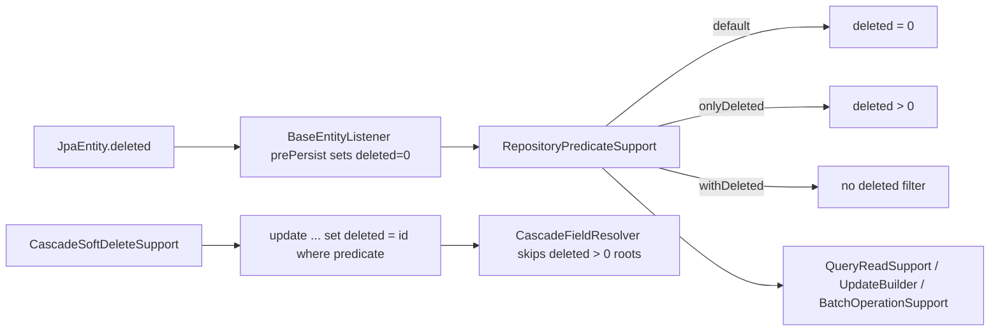

# Common Data JPA Deleted Token Implementation Plan

> **For Claude:** REQUIRED SUB-SKILL: Use superpowers:executing-plans to implement this plan task-by-task.

**Goal:** Replace `common-data-jpa` soft-delete semantics from nullable `deletedAt` timestamps to a numeric `deleted` token where `0` means active and the row `id` means soft-deleted.

**Architecture:** Keep soft delete as a repository-level cross-cutting concern owned by `JpaEntity`, `BaseRepositoryImpl`, and the query/delete helpers, but switch the active/deleted predicate from null checks to numeric comparisons. Delete operations should set `deleted = id` directly in SQL so bulk deletes and cascade deletes do not need a prior ID lookup. Tests and serialization exclusions must move with the new field so callers see one consistent model.

**Tech Stack:** Java 25, Spring Data JPA, QueryDSL, Hibernate, Maven multi-module build, JUnit 5, AssertJ, H2 integration tests.

---

## Requirements Confirmed

Confirmed with the user on 2026-05-21.

### Functional Requirements

- Replace `JpaEntity.deletedAt` with `Long deleted`.
- New rows must default to `deleted = 0`.
- Soft delete must set `deleted = id` for each affected row.
- Default reads must use `deleted = 0`.
- `onlyDeleted()` reads must use `deleted > 0`.
- `withDeleted()` must continue to include both active and deleted rows.
- Change all `common-data-jpa` soft-delete logic and affected tests to the new semantics.

### Explicit Non-Requirements

- No migration script is needed.
- No compatibility handling for old `deleted_at` data is needed.
- Do not preserve deletion timestamp behavior in JPA for this change.

### Edge Cases

- Batch soft delete must still reject empty business predicates.
- Cascade soft delete must skip entities already marked with `deleted > 0`.
- Bulk update and delete predicates must continue respecting query plugins and identity predicates.
- Physical delete must remain unchanged.

## Technical Design

### Component Responsibilities

- `JpaEntity`: own the `deleted` field instead of `deletedAt`.
- `BaseEntityListener`: initialize `deleted` to `0`.
- `BaseRepositoryImpl` and query helpers: expose and use a numeric deleted path.
- `CascadeSoftDeleteSupport`: guard active rows with `deleted = 0` and set `deleted = id` during soft delete.
- `CascadeFieldResolver`: treat `deleted > 0` as already deleted.
- `PopulateFieldBeanSerializerModifier`: exclude `deleted` from serialized payloads where `deletedAt` used to be excluded.
- Integration tests: assert `deleted` column values and SQL fragments instead of `deleted_at`.

### Risk Assessment

- **Risk:** Some tests or helper code may still reference `deletedAt` reflectively and fail compilation.
  - **Mitigation:** Search all `common-data-jpa` references and update the touched cross-module serializer exclusion in `common-starter`.
- **Risk:** QueryDSL path typing will break if any helper still expects `DateTimePath`.
  - **Mitigation:** Replace deleted-path plumbing consistently with `NumberPath<Long>` before running tests.
- **Risk:** Users lose deletion timestamp information.
  - **Mitigation:** This is an accepted tradeoff explicitly requested by the user for index semantics.

## Execution Tasks

### Task 1: Write failing characterization tests for deleted token semantics

**Files:**

- Modify: `common-data-jpa/src/test/java/org/example/commonlib/jpa/security/ScopedWriteProtectionIntegrationTest.java`
- Modify: `common-data-jpa/src/test/java/org/example/commonlib/jpa/batch/DeleteBatchExecutionIntegrationTest.java`
- Modify: `common-data-jpa/src/test/java/org/example/commonlib/jpa/cascade/CascadeSoftDeleteIntegrationTest.java`

**Steps:**

1. Change assertions that inspect `deleted_at` or null/non-null soft-delete state to inspect numeric `deleted` values.
2. Update any SQL-fragment assertions from `deleted_at` to `deleted`.
3. Run targeted tests and confirm they fail against the current `deletedAt` implementation.

Status: Completed.

Verification:

- `mvn -pl common-data-jpa -Dtest=ScopedWriteProtectionIntegrationTest,DeleteBatchExecutionIntegrationTest,CascadeSoftDeleteIntegrationTest test`
- Red phase failures showed:
  - DDL still created `deleted_at`
  - soft delete SQL still used `set deleted_at=?`
  - direct SQL assertions for `deleted` failed because the column did not exist

### Task 2: Implement deleted token semantics in JPA core classes

**Files:**

- Modify: `common-data-jpa/src/main/java/com/dev/lib/jpa/entity/JpaEntity.java`
- Modify: `common-data-jpa/src/main/java/com/dev/lib/jpa/entity/BaseEntityListener.java`
- Modify: `common-data-jpa/src/main/java/com/dev/lib/jpa/entity/BaseRepositoryImpl.java`
- Modify: `common-data-jpa/src/main/java/com/dev/lib/jpa/entity/UpdateBuilder.java`
- Modify: `common-data-jpa/src/main/java/com/dev/lib/jpa/entity/query/RepositoryPredicateSupport.java`
- Modify: `common-data-jpa/src/main/java/com/dev/lib/jpa/entity/delete/CascadeSoftDeleteSupport.java`
- Modify: `common-data-jpa/src/main/java/com/dev/lib/jpa/entity/delete/CascadeFieldResolver.java`

**Steps:**

1. Replace the entity field and path types from timestamp-based deleted tracking to numeric deleted tokens.
2. Switch default and deleted-only predicates to `eq(0L)` and `gt(0L)`.
3. Make soft delete updates set `deleted = id` in SQL and keep the existing flush/clear behavior.
4. Keep physical delete behavior unchanged.

Status: Completed.

Completed files:

- `common-data-jpa/src/main/java/com/dev/lib/jpa/entity/JpaEntity.java`
- `common-data-jpa/src/main/java/com/dev/lib/jpa/entity/BaseEntityListener.java`
- `common-data-jpa/src/main/java/com/dev/lib/jpa/entity/BaseRepositoryImpl.java`
- `common-data-jpa/src/main/java/com/dev/lib/jpa/entity/UpdateBuilder.java`
- `common-data-jpa/src/main/java/com/dev/lib/jpa/entity/query/RepositoryPredicateSupport.java`
- `common-data-jpa/src/main/java/com/dev/lib/jpa/entity/query/QueryReadSupport.java`
- `common-data-jpa/src/main/java/com/dev/lib/jpa/entity/batch/BatchOperationSupport.java`
- `common-data-jpa/src/main/java/com/dev/lib/jpa/entity/delete/CascadeSoftDeleteSupport.java`
- `common-data-jpa/src/main/java/com/dev/lib/jpa/entity/delete/CascadeFieldResolver.java`

### Task 3: Update supporting code and verification surfaces

**Files:**

- Modify: `common-starter/src/main/java/com/dev/lib/config/PopulateFieldBeanSerializerModifier.java`
- Modify: `memory.md`

**Steps:**

1. Update serializer exclusion to hide `deleted` instead of `deletedAt`.
2. Update memory with checkpoint status and verification evidence after each task.

Status: Completed.

Completed files:

- `common-starter/src/main/java/com/dev/lib/config/PopulateFieldBeanSerializerModifier.java`
- `memory.md`

### Task 4: Run targeted verification

**Files:**

- Modify: `memory.md`

**Steps:**

1. Run targeted `common-data-jpa` tests covering soft delete, cascade delete, batch delete, and scoped write protection.
2. If failures expose remaining `deletedAt` assumptions, patch them and rerun.
3. Record the final evidence and next state in `memory.md`.

Status: Completed.

Verification:

- `mvn -pl common-data-jpa -Dtest=ScopedWriteProtectionIntegrationTest,DeleteBatchExecutionIntegrationTest,CascadeSoftDeleteIntegrationTest test`
- Final result: 21 tests run, 0 failures, 0 errors, build success on 2026-05-21 Asia/Shanghai.
- Additional regression:
  - `mvn -pl common-data-jpa test`
  - Result: 108 tests run, 0 failures, 0 errors, build success.
  - `mvn -pl common-data-datalake -Dtest=DatalakeRepositoryWritePluginTest test`
  - Result: 4 tests run, 0 failures, 0 errors, build success.

Observed evidence:

- Generated DDL now creates `deleted bigint not null`.
- Insert SQL writes the `deleted` column.
- Soft delete SQL now uses `set deleted=<alias>.id`.
- Default queries use `deleted = 0`; deleted-only queries use `deleted > 0`.
