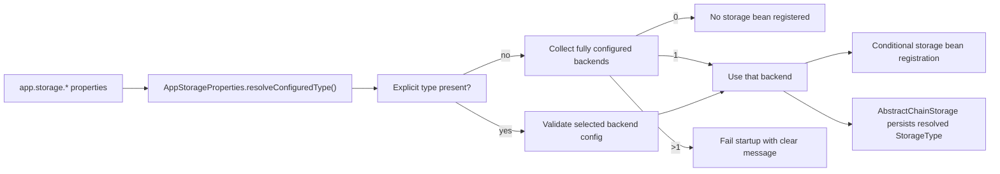

# Storage Auto Select Implementation Plan

> **For Claude:** REQUIRED SUB-SKILL: Use superpowers:executing-plans to implement this plan task-by-task.

**Goal:** Let `common-storage` auto-select the configured storage backend when exactly one backend is effectively configured, so `app.storage.type` is optional in the single-backend case.

**Architecture:** Keep `app.storage.type` as an explicit override, but move backend selection into a central resolver owned by `AppStorageProperties`. Concrete storage beans should register only when they are the resolved active backend. If no backend or multiple backends are configured without an explicit `type`, startup should fail with a precise error message instead of silently picking one.

**Tech Stack:** Java 25, Spring Boot 4 auto-configuration and conditional bean registration, Maven multi-module build, JUnit 5, AssertJ, `ApplicationContextRunner`.

---

## Requirements Confirmed

Confirmed on 2026-05-21 with the user.

### Functional Requirements

- `app.storage.local.path` alone should auto-activate local storage.
- A fully configured `minio`, `oss`, or `rustfs` backend alone should auto-activate that backend.
- `app.storage.type` remains allowed as an explicit selection override.
- If multiple backends are fully configured and `app.storage.type` is missing, startup must fail.
- The resolved backend type must still be written into `SysFile.storageType`.

### Non-Functional Requirements

- Do not require duplicate configuration for single-backend setups.
- Keep failure behavior deterministic and explicit.
- Do not weaken validation for partially configured backends.

### Edge Cases

- Blank local path must not count as a configured local backend.
- Partial remote config must not count as a configured backend.
- Explicit `app.storage.type` pointing to an unconfigured backend must fail fast with a clear error.
- `rustfs` must follow the same selection rule even though no runtime adapter currently exists.

## Technical Design

### Component Responsibilities

- `AppStorageProperties`: own backend completeness checks and effective backend resolution.
- `StorageAutoConfig`: expose the properties bean only; avoid hidden selection logic elsewhere.
- Storage adapter beans: register only when the resolved backend type matches their backend.
- `AbstractChainStorage`: persist the resolved backend type rather than the raw configured `type` field.

### Risk Assessment

- **Risk:** Storage beans still rely on `@ConditionalOnProperty`, which cannot express uniqueness checks.
  - **Mitigation:** Replace with a custom Spring condition that asks `AppStorageProperties` for the resolved backend.
- **Risk:** `rustfs` appears in config and enum, but has no adapter bean.
  - **Mitigation:** Treat it as a resolvable configured type for validation purposes, but only actual adapter beans participate in registration. If the user selects `rustfs`, startup should fail due to missing implementation rather than silently falling back.
- **Risk:** Existing callers may rely on `fileProperties.getType()` returning the active type.
  - **Mitigation:** Introduce an `effectiveType` resolver and migrate internal storage code to use it consistently.

## Execution Tasks

### Task 1: Add characterization tests for backend auto-selection

**Files:**

- Create: `common-storage/src/test/java/com/dev/lib/storage/config/StorageBackendSelectionTest.java`

**Steps:**

1. Write failing `ApplicationContextRunner` tests for:
   - local path only -> local bean registers
   - minio only -> minio bean registers
   - multiple backends without type -> context fails
   - explicit type with missing config -> context fails
2. Run the targeted test class and confirm failure against current `@ConditionalOnProperty` behavior.

Status: Completed.

Verification:

- `mvn -pl common-storage -Dtest=StorageBackendSelectionTest test`
- Initial red phase showed:
  - local-only config did not register `LocalChainStorage`
  - minio-only config did not register `MinioChainStorage`
  - multi-backend config started successfully instead of failing

### Task 2: Implement backend resolution in properties and conditions

**Files:**

- Modify: `common-storage/src/main/java/com/dev/lib/storage/config/AppStorageProperties.java`
- Create: `common-storage/src/main/java/com/dev/lib/storage/config/condition/OnResolvedStorageTypeCondition.java`
- Create: `common-storage/src/main/java/com/dev/lib/storage/config/condition/ConditionalOnResolvedStorageType.java`

**Steps:**

1. Add methods to detect whether each backend is fully configured.
2. Add a resolver for the effective backend type with explicit override and multi-config failure logic.
3. Add a custom condition annotation for matching the resolved type.

Status: Completed.

Completed files:

- `common-storage/src/main/java/com/dev/lib/storage/config/AppStorageProperties.java`
- `common-storage/src/main/java/com/dev/lib/storage/config/condition/ConditionalOnResolvedStorageType.java`
- `common-storage/src/main/java/com/dev/lib/storage/config/condition/OnResolvedStorageTypeCondition.java`

### Task 3: Rewire storage beans to resolved backend selection

**Files:**

- Modify: `common-storage/src/main/java/com/dev/lib/storage/domain/service/chain/LocalChainStorage.java`
- Modify: `common-storage/src/main/java/com/dev/lib/storage/domain/service/chain/MinioChainStorage.java`
- Modify: `common-storage/src/main/java/com/dev/lib/storage/domain/service/chain/OssChainStorage.java`
- Modify: `common-storage/src/main/java/com/dev/lib/storage/domain/service/chain/AbstractChainStorage.java`

**Steps:**

1. Replace `@ConditionalOnProperty` with the new resolved-type condition.
2. Make metadata persistence use the resolved type instead of the raw `type` field.
3. Keep adapter-local config validation intact.

Status: Completed.

Completed files:

- `common-storage/src/main/java/com/dev/lib/storage/domain/service/chain/LocalChainStorage.java`
- `common-storage/src/main/java/com/dev/lib/storage/domain/service/chain/MinioChainStorage.java`
- `common-storage/src/main/java/com/dev/lib/storage/domain/service/chain/OssChainStorage.java`
- `common-storage/src/main/java/com/dev/lib/storage/domain/service/chain/AbstractChainStorage.java`

Design deviation:

- `rustfs` remains unimplemented in runtime adapters. The resolution logic now recognizes its config shape, but there is still no `RustfsChainStorage` bean.

### Task 4: Verify and document the new startup behavior

**Files:**

- Modify: `common-storage/src/main/resources/application-storage.yaml`
- Modify: `memory.md`

**Steps:**

1. Update sample config comments so single-backend setup does not imply `type` is required.
2. Run targeted tests for the new behavior.
3. Record evidence and checkpoint state in `memory.md`.

Status: Completed.

Completed files:

- `common-storage/src/test/java/com/dev/lib/storage/config/StorageBackendSelectionTest.java`
- `common-storage/src/main/resources/application-storage.yaml`
- `memory.md`

Verification:

- `mvn -pl common-storage -Dtest=StorageBackendSelectionTest test`
- Final result: 4 tests run, 0 failures, 0 errors, build success.
