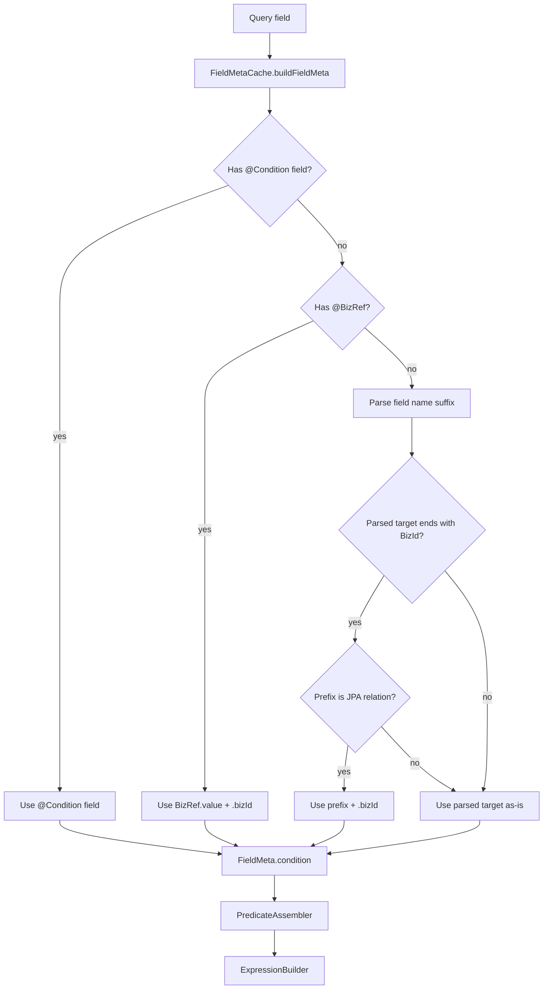

# BizRef DSL Implementation Plan

> **For Claude:** REQUIRED SUB-SKILL: Use superpowers:executing-plans to implement this plan task-by-task.

**Goal:** Add a concise DSL shortcut for querying associated entity public IDs without repeatedly writing `@Condition(field = "relation.bizId")`.

**Architecture:** Keep `JpaEntity.id` as the Long database identity and `bizId` as the String public identity. Resolve `@BizRef("relation")` and `xxxBizId` naming convention into `relation.bizId` during query field metadata construction, so existing JPA predicate assembly continues to consume normal target field parts.

**Tech Stack:** Java, Spring Data JPA, QueryDSL, JUnit 5, AssertJ, common-lib `DslQuery` metadata parsing.

---

## Confirmed Requirements

- Do not change `JpaEntity.id` or `JpaEntity.bizId` types.
- Add annotation `com.dev.lib.entity.dsl.BizRef`.
- `@BizRef("goods") private String xx;` resolves to target field `goods.bizId`.
- `@BizRef("goods") private Collection<String> xx;` resolves to target field `goods.bizId` and query type `IN`.
- A field ending in exact uppercase suffix `BizId` maps to an association `bizId` when the prefix is a JPA relation.
- `private String goodsBizId;` resolves to target field `goods.bizId` only when `goods` is a relation on the query entity.
- `private Collection<String> goodsBizIdIn;` resolves to target field `goods.bizId` and query type `IN`.
- Only exact `BizId` is recognized. Do not support lowercase or mixed variants such as `bizid`, `BIZID`, or `bizId` suffix conventions beyond normal Java field text.
- Existing explicit condition wins: `@Condition(field = "...")` has priority over `@BizRef`.

## Design



### Component Responsibilities

- `BizRef`: declarative marker for public-id association lookups.
- `QueryFieldParser`: continue parsing query type suffixes (`In`, `Like`, `Ne`, etc.) and returning the raw parsed target. It should not need JPA relation awareness.
- `FieldMetaCache`: own target-field resolution priority and relation-aware `xxxBizId` convention.
- `PredicateAssembler` / `ExpressionBuilder`: unchanged consumers of `FieldMeta.targetFieldParts()`.

### Resolution Priority

1. If `@Condition(field = "...")` is present and non-blank, use that field.
2. Else if `@BizRef("...")` is present and non-blank, use `<value>.bizId`.
3. Else if parsed target ends with exact `BizId`, strip it, lower-case the first character of the remaining prefix, and if that prefix resolves as a relation, use `<prefix>.bizId`.
4. Else keep existing parsed target.

### Validation And Failure Behavior

- Blank `@BizRef` value should fail fast with `IllegalArgumentException`.
- `@BizRef` should be valid only on condition fields. If used with a non-simple type that would otherwise be a group, fail fast with a clear message.
- `@BizRef` should not convert fields with explicit `@Condition(field = "...")`.
- `xxxBizId` convention should not fail when `xxx` is not a relation; it should preserve existing behavior to avoid breaking existing entity fields.

## Risks

- **Ambiguous naming:** An entity may contain a real `goodsBizId` column. Mitigation: automatic conversion only when `goods` resolves as a relation.
- **Annotation conflict:** `@Condition` and `@BizRef` may both exist. Mitigation: `@Condition(field = "...")` wins.
- **Core/JPA boundary:** `FieldMetaCache` is in `common-core` and relation resolution is pluggable. Mitigation: use existing `RelationResolver.Holder`, no direct JPA dependency.
- **Cached metadata:** `FieldMetaCache` caches by query class. Mitigation: tests should use unique query classes for each behavior.

## Task 1: Add `@BizRef` Metadata Support

**Files:**
- Create: `common-core/src/main/java/com/dev/lib/entity/dsl/BizRef.java`
- Modify: `common-core/src/main/java/com/dev/lib/entity/dsl/core/FieldMetaCache.java`
- Test: `common-data-jpa/src/test/java/com/dev/lib/jpa/entity/dsl/PredicateAssemblerLogicTest.java`

**Step 1: Write failing tests**

Add tests covering:
- `@BizRef("goods") private String anyName;` produces predicate key targeting `testJpaEntity.goods.bizId`.
- `@Condition(field = "goods.name") @BizRef("goods") private String anyName;` keeps `goods.name`.
- blank `@BizRef("")` fails during metadata resolution with a clear message.

**Step 2: Run red test**

Run:

```bash
mvn -pl common-data-jpa -Dtest=PredicateAssemblerLogicTest test
```

Expected: compilation failure or test failure because `BizRef` does not exist.

**Step 3: Implement annotation and resolver**

- Add `@Target(ElementType.FIELD)` and `@Retention(RetentionPolicy.RUNTIME)`.
- Add `String value();`.
- In `FieldMetaCache.buildFieldMeta`, read `BizRef`.
- Update target field resolution to use the priority listed above.
- Validate blank `BizRef.value()`.

**Step 4: Run green test**

Run:

```bash
mvn -pl common-data-jpa -Dtest=PredicateAssemblerLogicTest test
```

Expected: tests pass.

## Task 2: Add `xxxBizId` Convention

**Files:**
- Modify: `common-core/src/main/java/com/dev/lib/entity/dsl/core/FieldMetaCache.java`
- Test: `common-data-jpa/src/test/java/com/dev/lib/jpa/entity/dsl/PredicateAssemblerLogicTest.java`

**Step 1: Write failing tests**

Add tests covering:
- `private String goodsBizId;` maps to `goods.bizId`.
- `private Collection<String> goodsBizIdIn;` maps to `goods.bizId` with query type `IN`.
- `private String goodsbizid;` does not map to `goods.bizId`.
- a non-relation prefix ending in `BizId` preserves current field behavior.

**Step 2: Run red test**

Run:

```bash
mvn -pl common-data-jpa -Dtest=PredicateAssemblerLogicTest test
```

Expected: new convention tests fail because `goodsBizId` remains `goodsBizId`.

**Step 3: Implement convention**

- Add helper in `FieldMetaCache` to inspect parsed target after suffix parsing.
- Detect exact suffix `BizId`.
- Strip suffix and lower-case first prefix character.
- Resolve the prefix through existing `resolveRelation(entityClass, prefix)`.
- Only return `<prefix>.bizId` when relation exists.

**Step 4: Run green test**

Run:

```bash
mvn -pl common-data-jpa -Dtest=PredicateAssemblerLogicTest test
```

Expected: tests pass.

## Task 3: Documentation And Focused Regression

**Files:**
- Modify: `common-core/src/main/java/com/dev/lib/entity/dsl/Condition.java`
- Modify: `docs/plans/2026-05-28-bizref-dsl-implementation-plan.md`
- Modify: `memory.md`

**Step 1: Update docs**

- Document `@BizRef("goods")`.
- Document `goodsBizId` and `goodsBizIdIn` convention.
- Document priority with `@Condition`.

**Step 2: Run focused tests**

Run:

```bash
mvn -pl common-core,common-data-jpa -Dtest=PredicateAssemblerLogicTest test
```

Expected: build success and all targeted tests pass.

**Step 3: Run module regression**

Run:

```bash
mvn -pl common-data-jpa test
```

Expected: build success and all common-data-jpa tests pass.

## Checkpoints

- Checkpoint 1 after `@BizRef` explicit annotation behavior passes.
- Checkpoint 2 after `xxxBizId` convention behavior passes.
- Checkpoint 3 after docs and module regression pass.

## Progress

### Checkpoint 1: `@BizRef` Explicit Annotation

Completed files:
- Created `common-core/src/main/java/com/dev/lib/entity/dsl/BizRef.java`.
- Modified `common-core/src/main/java/com/dev/lib/entity/dsl/core/FieldMetaCache.java`.
- Added tests in `common-data-jpa/src/test/java/com/dev/lib/jpa/entity/dsl/PredicateAssemblerLogicTest.java`.

Verification:
- RED: `mvn -pl common-data-jpa -Dtest=PredicateAssemblerLogicTest test` failed because `BizRef` did not exist.
- GREEN: `mvn -pl common-data-jpa -am -Dtest=PredicateAssemblerLogicTest -Dsurefire.failIfNoSpecifiedTests=false test` passed.
- Result: `PredicateAssemblerLogicTest` ran 19 tests, 0 failures, 0 errors.

Deviation:
- Used `-am` plus `-Dsurefire.failIfNoSpecifiedTests=false` for GREEN verification because `BizRef` lives in upstream `common-core`, and Maven otherwise applies the selected test name to upstream modules with no matching tests.

### Checkpoint 2: `xxxBizId` Relation Convention

Completed files:
- Modified `common-core/src/main/java/com/dev/lib/entity/dsl/core/FieldMetaCache.java`.
- Added relation fixture and convention tests in `common-data-jpa/src/test/java/com/dev/lib/jpa/entity/dsl/PredicateAssemblerLogicTest.java`.

Verification:
- RED: `mvn -pl common-data-jpa -am -Dtest=PredicateAssemblerLogicTest -Dsurefire.failIfNoSpecifiedTests=false test` failed with 2 expected failures:
  - `goodsBizId` resolved to `testJpaEntity.goodsBizId`.
  - `goodsBizIdIn` resolved to `testJpaEntity.goodsBizId`.
- GREEN: `mvn -pl common-data-jpa -am -Dtest=PredicateAssemblerLogicTest -Dsurefire.failIfNoSpecifiedTests=false test` passed.
- Result: `PredicateAssemblerLogicTest` ran 23 tests, 0 failures, 0 errors.

Deviation:
- Registered `JpaRelationResolver` in the unit test with `@BeforeAll` because this test does not run through Spring and relation convention depends on `RelationResolver.Holder`.

### Checkpoint 3: Documentation And Regression

Completed files:
- Updated `common-core/src/main/java/com/dev/lib/entity/dsl/Condition.java` docs.
- Updated `docs/plans/2026-05-28-bizref-dsl-implementation-plan.md`.
- Cleared `memory.md` to a one-sentence completion summary.

Verification:
- Focused command: `mvn -pl common-data-jpa -am -Dtest=PredicateAssemblerLogicTest -Dsurefire.failIfNoSpecifiedTests=false test`.
- Focused result: `PredicateAssemblerLogicTest` ran 23 tests, 0 failures, 0 errors, reactor build success.
- Regression command: `mvn -pl common-data-jpa -am -Dsurefire.failIfNoSpecifiedTests=false test`.
- Regression result: `common-data-jpa` ran 115 tests, 0 failures, 0 errors, reactor build success.
