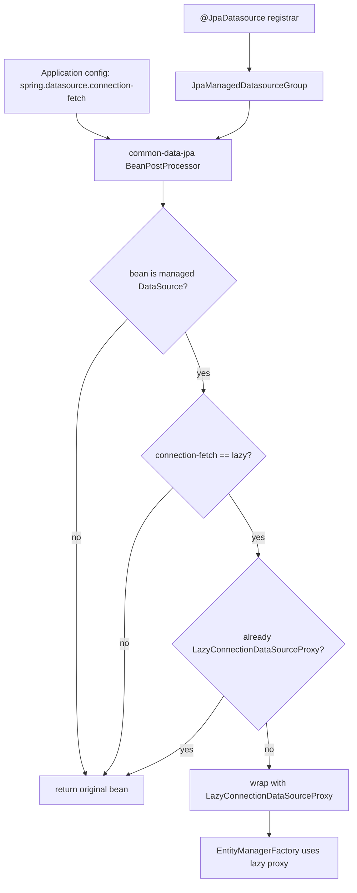

# Multi Datasource Lazy Connection Fetch Implementation Plan

> **For Claude:** REQUIRED SUB-SKILL: Use superpowers:executing-plans to implement this plan task-by-task.

**Goal:** Make `spring.datasource.connection-fetch=lazy` apply to `@JpaDatasource` managed multi-datasource beans so JDBC connections are fetched only when SQL is executed.

**Architecture:** Keep Spring Boot's native single-datasource behavior unchanged. Add common-data-jpa support only for datasource bean names registered through `@JpaDatasource`, wrapping those beans in `LazyConnectionDataSourceProxy` when the shared Spring Boot property is set to `lazy`.

**Tech Stack:** Spring Boot 4.1 JDBC autoconfiguration semantics, Spring `BeanPostProcessor`, `LazyConnectionDataSourceProxy`, common-data-jpa `JpaManagedDatasourceGroup`, JUnit 5, AssertJ, `WebApplicationContextRunner`.

---

## Phase 1: Confirmed Requirements

Confirmed on 2026-06-01:

- Only multi-datasource behavior needs to be added in common-data-jpa.
- Only datasource beans declared through `@JpaDatasource` should be processed.
- Unmanaged datasource beans must not be changed.
- Both `HikariDataSource` and non-Hikari `DataSource` implementations can be wrapped.
- Existing `LazyConnectionDataSourceProxy` instances must not be wrapped twice.
- The trigger is `spring.datasource.connection-fetch=lazy`.
- User intent: transactions that hit only cache or otherwise do not issue SQL should not acquire a physical database connection.

## Phase 2: Technical Design

### Architecture Diagram



### Component Responsibilities

- `JpaDatasourceRegistrar`: already records the datasource bean names declared by `@JpaDatasource`; no behavior change expected.
- New or extended `BeanPostProcessor`: reads `spring.datasource.connection-fetch`, checks whether a datasource bean is managed by `@JpaDatasource`, and conditionally wraps it in `LazyConnectionDataSourceProxy`.
- Existing `JpaManagedHikariDefaultsBeanPostProcessor`: should continue to apply Hikari defaults before the datasource is wrapped, so Hikari-specific tuning remains available.
- Tests: prove that managed multi-datasource beans are lazily proxied, unmanaged datasource beans are left alone, and non-lazy mode leaves managed beans unchanged.

### Data Flow

1. `@JpaDatasource` registers `JpaManagedDatasourceGroup` with managed datasource bean names.
2. Spring creates datasource beans.
3. Existing Hikari defaults post-processor applies pool defaults before initialization.
4. New lazy connection post-processor runs after initialization.
5. If `spring.datasource.connection-fetch=lazy`, managed datasource beans are returned as `LazyConnectionDataSourceProxy`.
6. Multi-datasource entity manager factories receive the proxied datasource and fetch physical connections only when SQL is needed.

### Risks And Mitigations

- Risk: wrapping before Hikari defaults prevents pool tuning. Mitigation: run lazy wrapping after initialization and keep Hikari defaults in `postProcessBeforeInitialization`.
- Risk: wrapping unmanaged datasources changes behavior outside JPA. Mitigation: filter strictly by `JpaManagedDatasourceGroup`.
- Risk: double wrapping. Mitigation: return original bean when it is already `LazyConnectionDataSourceProxy`.
- Risk: single datasource gets double handled by common-data-jpa and Spring Boot. Mitigation: common-data-jpa processor only handles managed datasource names from `@JpaDatasource`; single datasource path has no managed group.

### Technology Justification

`LazyConnectionDataSourceProxy` is the same Spring JDBC primitive used by Spring Boot 4's native `spring.datasource.connection-fetch=lazy` support. Reusing it preserves Boot semantics instead of creating a custom datasource wrapper.

## Task Breakdown

### Task 1: Failing tests for multi-datasource lazy fetch

**Files:**
- Modify: `common-data-jpa/src/test/java/org/example/commonlib/jpa/MultiJpaDatasourceIntegrationTest.java`

**Step 1: Write failing tests**

- Add a test that sets `spring.datasource.connection-fetch=lazy` and asserts `primaryDs` and `archiveDs` beans are `LazyConnectionDataSourceProxy`.
- Assert `ignoredDs` remains a raw `HikariDataSource`.
- Add a test that sets `spring.datasource.connection-fetch=eager` and asserts managed datasource beans are not lazy proxies.

**Step 2: Verify red**

Run:

```bash
mvn -pl common-data-jpa -Dtest=MultiJpaDatasourceIntegrationTest test
```

Expected: new lazy multi-datasource test fails because managed datasource beans are not currently wrapped.

### Task 2: Implement lazy proxy for managed multi-datasources

**Files:**
- Create or modify: `common-data-jpa/src/main/java/com/dev/lib/jpa/multiple/*Lazy*Connection*BeanPostProcessor.java`
- Modify: `common-data-jpa/src/main/java/com/dev/lib/jpa/CommonJpaAutoConfig.java`

**Implementation constraints:**

- Read `spring.datasource.connection-fetch` from the Spring `Environment`.
- Only apply when the value equals `lazy` ignoring case.
- Only apply to bean names present in `JpaManagedDatasourceGroup`.
- Only apply to `DataSource` beans.
- Do not wrap `LazyConnectionDataSourceProxy` again.
- Use an order that lets Hikari defaults run before wrapping.

**Step 1: Implement minimal code**

Add a BeanPostProcessor and register it as a static bean in `CommonJpaAutoConfig`.

**Step 2: Verify green**

Run:

```bash
mvn -pl common-data-jpa -Dtest=MultiJpaDatasourceIntegrationTest test
```

Expected: tests pass.

### Task 3: Regression verification and documentation sync

**Files:**
- Modify: `docs/plans/2026-06-01-multi-datasource-lazy-connection-fetch.md`
- Modify: `memory.md`

**Step 1: Run focused module checks**

Run:

```bash
mvn -pl common-data-jpa -Dtest=MultiJpaDatasourceIntegrationTest,NestedMultiDatasourceRepositoryIntegrationTest test
```

Expected: tests pass.

**Step 2: Update progress**

Record completed files, exact commands, results, and deviations in this plan and `memory.md`.

## Checkpoints

- Checkpoint A: Phase 2 design approved before implementation.
- Checkpoint B: Task 1 red test observed before production code changes.
- Checkpoint C: Task 2 green targeted test observed before broader verification.
- Checkpoint D: Final focused verification passed and `memory.md` reduced only after full plan completion.

## Progress Log

- 2026-06-01: Requirements confirmed. Phase 2 design drafted. Waiting for design approval before implementation.
- 2026-06-01: Phase 2 design approved. Task 1 tests added in `common-data-jpa/src/test/java/org/example/commonlib/jpa/MultiJpaDatasourceIntegrationTest.java`.
- 2026-06-01: RED verification command `mvn -pl common-data-jpa -am -Dtest=MultiJpaDatasourceIntegrationTest -Dsurefire.failIfNoSpecifiedTests=false test` failed as expected. Failure: `hasLazyConnectionProxy(primaryDs)` was false for managed datasource when `spring.datasource.connection-fetch=lazy`.
- 2026-06-01: Task 2 implemented `JpaManagedLazyConnectionDataSourceBeanPostProcessor` and registered it in `CommonJpaAutoConfig`.
- 2026-06-01: GREEN verification command `mvn -pl common-data-jpa -am -Dtest=MultiJpaDatasourceIntegrationTest -Dsurefire.failIfNoSpecifiedTests=false test` passed. Result: 7 tests run, 0 failures, 0 errors.
- 2026-06-01: Final focused verification command `mvn -pl common-data-jpa -am -Dtest=MultiJpaDatasourceIntegrationTest,NestedMultiDatasourceRepositoryIntegrationTest -Dsurefire.failIfNoSpecifiedTests=false test` passed. Result: 8 tests run, 0 failures, 0 errors, build success.

## Final Retrospective

- Requirements documented: Yes.
- Design approved: Yes.
- Tests passing: 8/8 focused tests.
- Coverage: Not measured for this narrow configuration change.
- Checkpoints completed: 4.
- Deviation: Tests account for the existing datasource-proxy decorator by checking the datasource unwrap/decorator chain for `LazyConnectionDataSourceProxy`, rather than requiring the lazy proxy to be the outermost bean.
